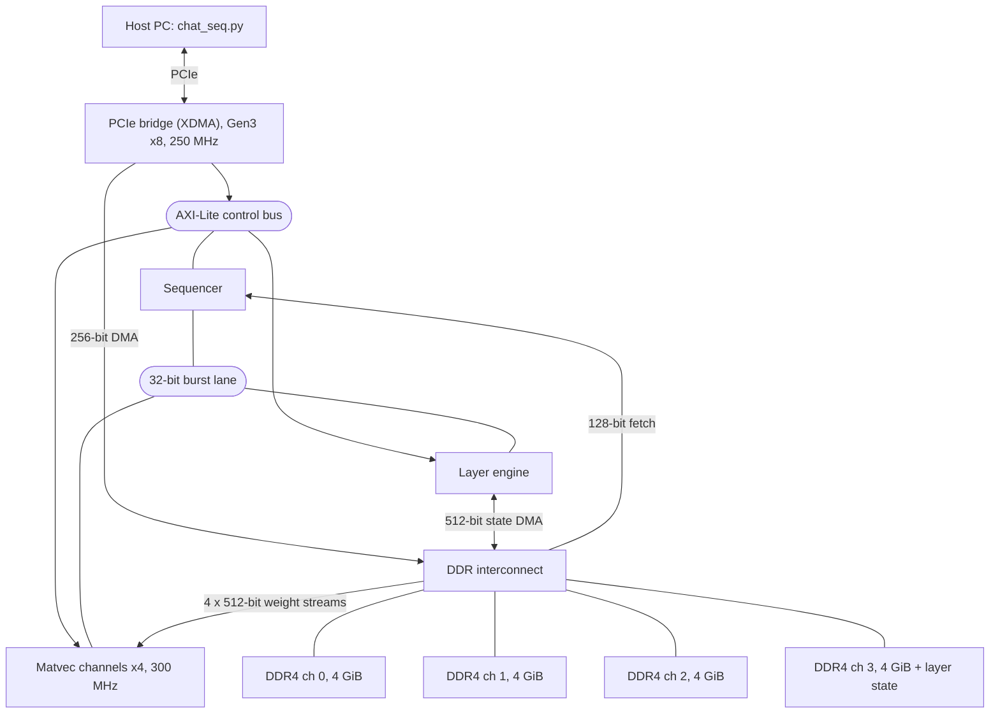
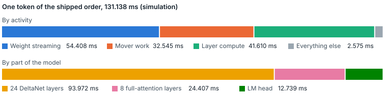
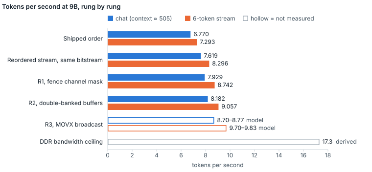

# fable5_llm

A nine-billion-parameter language model, Qwen3.5-9B, decoding on a single SQRL BCU-1525 FPGA board (Xilinx xcvu9p). It was built from an empty directory: custom SystemVerilog, a custom instruction set and a fixed-point reference model of everything. No vendor AI IP and no HLS. The hardware matches its own integer reference model bit for bit.

**Interactive tour: https://coreyhahn.github.io/fable5_llm/**

The tour has the clickable machine diagram, the tooltips and the full figures. This README is its Markdown version. Figures are as of 1 October 2026. Each one carries a provenance label: **silicon** (measured on the board), **sim** (Verilator chip testbench or Python harness), **model** (a prediction) or **derived** (arithmetic done for the tour from repo figures).

## Key figures

| Figure | What it is |
|---|---|
| **4.09 GB** | weights streamed from four DIMMs for every token |
| **39,146** | sequencer records executed per decode step |
| **8.18 tok/s** | best chat decode measured on silicon (R2 build) |
| **4 ps** | worst timing slack over 1.32 million endpoints, newest build |
| **11,593** | lines of RTL, inside about 235,000 tracked lines |
| **1,611** | commits in the development history, and 46 numbered builds, since 10 June 2026 |

## How it works

Decoding one token at batch size one uses every weight in the model once. The 9B pack is 249 matrices totalling 3,902 MiB at 4.125 bits per weight, about 7.9 billion multiply-accumulates per token (derived). All the block RAM and UltraRAM on the xcvu9p adds up to about 44 MB (derived), roughly one percent of that. So the weights live in four 4 GiB DDR4 DIMMs and are streamed past the multipliers again for every token. The four channels deliver 70.70 GB/s together (silicon). That sets a ceiling near 17.3 tokens per second (derived) before any other work is counted.

The host does almost nothing per token. A sequencer on the chip reads a program out of DDR and drives one layer engine and four matvec channels, one per DIMM. One token goes like this:

1. **The host arms the step.** It overwrites a header of a few dozen bytes in DDR with the token id and position, then writes START.
2. **The sequencer fetches its program.** 16-byte records arrive in bursts and are validated at decode. A decode step is 39,146 of them.
3. **Normalize, then quantize x.** RMSNorm and DYNQ8 run on the scratchpad. DYNQ8 picks the vector's exponent and the sequencer keeps it in an index register.
4. **MOVX** copies the int8 vector into each channel's input buffer.
5. **MVGO** launches the four engines without waiting. Each streams its quarter of the rows from its own DIMM, 128 four-bit weights per beat.
6. **FENCE** waits for the engines. On the shipped schedule this wait is 42% of the step.
7. **MOVY** reads the 32-bit sums back, shifts them by an amount completed on the chip from the exponent, rounds and writes the scratchpad.
8. **Layer state swaps.** The state DMA loads the next layer's state from DDR channel 3 and stores the previous one, while compute carries on.
9. **After 32 layers, one token.** The LM head scans 248,320 vocabulary rows with a running argmax. The winning id goes into a token FIFO and the host reads it.

Steps 3 to 7 repeat for every projection: a decode step launches 1,370 matvecs. Everything runs on the bridge's 250 MHz clock except the four matvec engines, which run on their DIMM's 300 MHz clock. The record format and every opcode are specified in [`docs/SEQ_ISA.md`](docs/SEQ_ISA.md). There are three nested instruction sets: 12 sequencer records, 14 layer commands and 12 ALU operations.

## Where the time goes

<picture>
  <source media="(prefers-color-scheme: dark)" srcset="docs/img/budget-dark.svg">
  
</picture>

The three activities sum to 98% of the token, so they happen almost entirely one after another. On the board the sequencer sits in a FENCE for 42.0% of the step and no matvec engine is busy for 57.8% of it (silicon). The DDR path, which the physics says is the limit, is idle more than half the time. Every speed-up since the 9B first ran has overlapped those activities. A dependency model puts the limit of overlap at 86.7 ms per token, 1.51 times the shipped order (model).

| Round | What changed | Chat gain |
|---|---|---|
| Reorder | Software only. Fences moved to the point of use, a dependency-safe reorder, redundant MOVX removed. | ×1.125 (silicon) |
| R1 | FENCE takes a channel mask and waits only for the channels it names. | ×1.041 (silicon) |
| R2 | A second bank in each input and result memory, so the next x can be staged while an engine runs. | ×1.032 (silicon) |
| R3 | One scratchpad read broadcast to all four channels over a direct 376-flop bus. Built and signed off, not loaded. | ×1.085 (model) |

<picture>
  <source media="(prefers-color-scheme: dark)" srcset="docs/img/ladder-dark.svg">
  
</picture>

Every measured rung produced identical tokens to the one before it. The bitstream resident on the board is build_041. The R2 build (build_045) was loaded for measurement. R3 (build_046_r3_incr) is built and signed off but has not been loaded, so its rates are predictions. The best measured stream rate is about half of what the DIMMs could feed.

## Two kinds of layer

Qwen3.5 is a hybrid. Three layers in four are DeltaNet linear attention and every fourth is ordinary attention. They share the matvec engines and the scratchpad and nothing else.

| | DeltaNet layer | Full-attention layer |
|---|---|---|
| Count | 24 of 32 | 8 of 32 |
| Memory of the sequence | a 128 × 128 matrix per value head, 1 MiB per layer | int8 KV cache, 128 MiB region |
| Work per token | constant | grows with context |
| Unit | `dn_step`, 128 parallel lanes, 22-state FSM | `attn_core`, head dim 256, 42-state FSM |
| Heads | 16 key, 32 value | 16 query over 4 key/value |
| Area | 42,012 LUTs, 1,279 DSPs | 36,639 LUTs, 529 DSPs |
| Time per layer | 3.916 ms (sim) | 3.051 ms (sim) |

The context cost shows on the board: a decode step takes 137.7 ms near position 30 and 147.9 ms near position 520, 7.4% more (silicon).

## Bit-exact integers

There is no floating point on the chip. Every operation is an exact integer algorithm defined in [`ref/layer_fixed.py`](ref/layer_fixed.py), and the RTL has to reproduce it bit for bit. When hardware and reference disagree, the bug is real. Weights are INT4 with one uint16 scale per 128. Matvec inputs are int8 with a per-vector exponent that DYNQ8 chooses on the chip, per vector, per token. Rounding is half away from zero everywhere. The vector ALU is a single lane because argmax ties must resolve to the first index.

An answer has to survive this chain: the bf16 checkpoint, a float anchor (`layer_ref.py`), the integer law (`layer_fixed.py`, 2,679 lines), an emitter that writes the record stream and weight pack, a pure-Python executor of the stream (`seq_model.py`), the chip testbench running the real RTL in Verilator, and finally silicon. On the board the 9B gate matched 24 of 24 tokens over four prompts, 36,886 state checks on each of eight full-model runs, and the entire 162,529,280-byte state region against the emitter's hash (silicon). The gate report is [`evidence/qwen9b/g6/RD9_GATE.md`](evidence/qwen9b/g6/RD9_GATE.md).

## State moved to DDR

At 0.8B and 2B every layer's state sat in on-chip memory. The 9B design done the same way needed 928 of the device's 960 UltraRAMs. It placed but did not meet timing: the best of eleven out-of-context placements was 0.554 ns short. The redesign moved all layer state into DDR channel 3 and left a two-slot cache on the chip for each layer kind. A 512-bit DMA engine stores one layer's state and loads the next while compute runs. UltraRAM use fell from 928 to 182. The DMA lane costs 5.125 ms per token beside 41.588 ms of compute (silicon).

| State region, DDR channel 3 | Size |
|---|---|
| DeltaNet matrices, 24 layers × 1 MiB | 24 MiB |
| KV cache, sized for 4,096 positions | 128 MiB |
| Conv taps and history, 24 × 128 KiB | 3 MiB |

## Fitting the device

The xcvu9p is three dies on an interposer. The design uses 26% of the LUTs, but the layer engine takes 81% of one die's DSPs and all of the UltraRAM in use. The main clock is 250 MHz because the PCIe bridge generates it. The newest build closes with 0.004 ns to spare. The bitstream on the board closes with exactly 0.000. Six placement runs of the same netlist spread over 0.512 ns, so that margin is far smaller than the tool's run-to-run noise.

| build_046 | Die 0 | Die 1 | Die 2 |
|---|--:|--:|--:|
| Logic blocks used | 61.9% | 66.2% | 7.3% |
| LUTs | 152,630 | 141,740 | 15,457 |
| Flip-flops | 115,833 | 182,654 | 21,656 |
| DSP slices | 1,845 | 12 | 3 |
| UltraRAM | 182 | 0 | 0 |
| Block RAM tiles | 112.5 | 113 | 25.5 |

On the resident build, the first placement missed by 0.859 ns and the best of four placement directives by 0.156 ns. Floorplan regions made it worse every time one was added, so the shipped build has none. What closed timing was moving the clock root to the layer engine's centroid: worst slack went from −0.156 to 0.000 ns. R1, R2 and R3 were each built incrementally against a signed-off checkpoint and closed at +0.001, +0.004 and +0.004 ns.

## What's inside

| Path | Contents |
|---|---|
| [`rtl/`](rtl/) | the custom RTL: 23 files, 11,593 lines |
| [`ref/`](ref/) | the reference chain: `layer_ref.py`, `layer_fixed.py`, `seq_model.py` |
| [`sw/`](sw/) | host-side tools, including `chat_seq.py` |
| [`tb/`](tb/) | 23 Verilator testbenches, 11,406 lines |
| [`synth/`](synth/) | Vivado build scripts (76 TCL files) and constraints (23 XDC files, 14 of them floorplan experiments) |
| [`docs/`](docs/) | [`ARCHITECTURE.md`](docs/ARCHITECTURE.md), [`USAGE.md`](docs/USAGE.md), [`SEQ_ISA.md`](docs/SEQ_ISA.md), [`HISTORY.md`](docs/HISTORY.md), and the tour source [`index.html`](docs/index.html) |
| [`evidence/`](evidence/) | 4,860 tracked evidence files and 22 gate reports |

The repo also holds 33 reference-model and generator scripts. The RTL is 4.9% of the tracked text; the rest generates its inputs, checks its outputs and records what was measured. Start with [`docs/ARCHITECTURE.md`](docs/ARCHITECTURE.md) for the system tour and [`docs/USAGE.md`](docs/USAGE.md) to run it.

## Known hazards

These are the ways it can be wrong without saying so. Each is on the record in the repository.

- **DDR reused without resetting the state region:** the wrong token comes back with error code 0x00. The chat tool now writes the region itself; the lower-level runner still has the defect.
- **Weight pack in DDR from a different model:** the identity gate passes. Nothing ties the resident pack to the resident model. Still open.
- **Host slow to drain the token FIFO:** a push past 64 entries drops the token. A sticky overflow bit records it.
- **An R2 stream on a bitstream without R2:** second-bank accesses silently use the first. The host checks a capability register first. R1 and R3 streams fault at decode instead.
- **Context reaches 512 positions:** a 40-bit sum in the attention core can wrap in the worst case. 526 positions have matched on the board, which is evidence and not proof. The ceiling is held at 511 by analysis.
- **Reference run at the wrong residual format:** 12,096 wrong shifts in the reference went unseen for 17 hours. The format is now derived from the model tag.
- **Placer moves the layer engine to another die:** the clock-root constraint still applies, pointing at the wrong die. A script checks every routed build, but it reports OK when both locations are unknown, so that result is read as a failure.
- **A 4-core workstation doing the arithmetic:** it computed wrong results twice in the 9B campaign. All numeric work now runs on the server.

## The method

The rules, enforced from day one by [`CHARTER.md`](CHARTER.md):

1. **A bit-exact reference precedes RTL.** Simulation gates precede silicon. Hardware claims are gated on four seeds, each run twice without reprogramming, and every gate's evidence is committed under `evidence/`.
2. **Negative results are shipped, not buried.** The 0.8B rung that made things slower is documented with the same rigour as the wins. So is the 928-UltraRAM design that did not close timing.
3. **Measure before building.** Optimization rounds begin with a cycle census. On the 0.8B ladder, a census showed the planned third rung would not help until the movers were fixed.
4. **Timing honesty.** Reported slack comes from fresh routed checkpoints, and the resident bitstream's version register traces to the git commit that built it.

An unusual constraint made the honesty enforceable. A private implementation of the same goal existed the whole time (the "answer key") and was kept strictly unread. Every design decision here was derived from the datasheets, the measurements and the math.

This was also an experiment in AI-assisted engineering. The work was directed by a human and executed by Claude (Anthropic) orchestrating teams of Opus agents under frozen interface contracts: investigation agents that measured before speccing, implementation agents on disjoint file ownership, and verification agents whose testbenches caught two silent RTL bugs (a descriptor double-execution and a FIFO token-loss race) before they reached hardware. The session-by-session narrative is in [`docs/HISTORY.md`](docs/HISTORY.md).

## Earlier stages

The first working model was Qwen3.5-0.8B. Its first version drove the engines from Python, register by register: about 100,000 MMIO accesses and 9.3 seconds per token. The speed ladder that followed, each rung measured on the board (silicon):

| Rung | What changed | tok/s |
|---|---|--:|
| 0 | host-driven MMIO orchestration (baseline) | 0.11 |
| 1 | on-chip command sequencer: the chip fetches and executes its own 60,495-record decode loop | 4.91 |
| 1b | 4-channel weight split: functional but 15% slower, kept and documented | n/a |
| 2 | `vec_alu` and `vecnorm` rebuilt as one-element-per-clock pipelines | 6.40 |
| 3 | burst mover path replacing single-beat AXI-Lite moves | 15.56 |
| 4 | zero-bubble matvec, 4-channel interleaved LM head, on-chip top-k | 30.4 |

Qwen3.5-2B then ran on silicon at 16.1 tok/s on 25 August 2026, on the first bitstream with no timing waiver. Qwen3.5-9B first ran on silicon on 9 September 2026 at 7.29 tok/s, with every token and state hash matching.

## Honest limitations

- **4-bit weights.** Against the bf16 original, the quantized 9B agrees on the top token in 98 of 108 teacher-forced steps (sim). GPTQ cut the perplexity penalty from +8.79% to +2.58% (sim).
- **Context is capped at 511 positions** by analysis, until a register in the attention core is widened.
- **The fastest build is not on the board.** R3 rates are a model prediction until build_046_r3_incr is loaded and measured.
- **Timing margin is effectively zero.** The resident bitstream closes at 0.000 ns, inside the placer's run-to-run spread.
- **Reproducing this needs this specific board** (BCU-1525) and a Vivado seat.

## License and provenance

MIT (see [`LICENSE`](LICENSE)). Qwen3.5 weights are downloaded separately from Hugging Face under their license and are not distributed here. Board constraint files derive from the vendor's public board package, with attribution preserved in [`synth/constraints/PROVENANCE.md`](synth/constraints/PROVENANCE.md).
