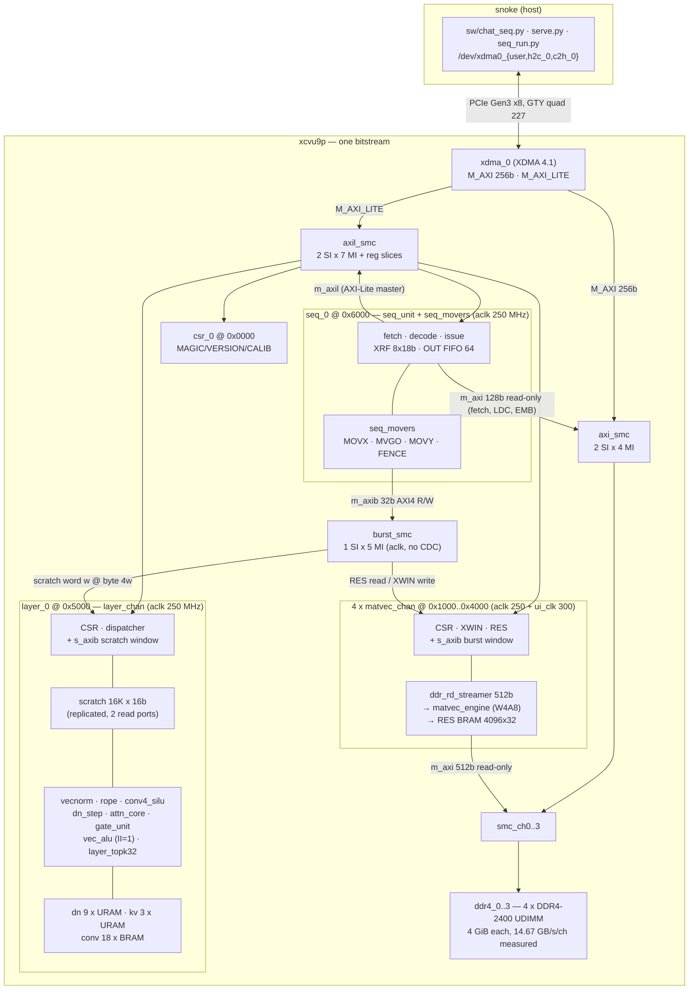

# ARCHITECTURE — fable5_llm as built

**As of 2026-08-12, rung 4** (repo HEAD `ae5a316`). This is the current-state
description: what is on the board, what runs on it, and where the time goes.
The rest of `docs/` is delta-documentation — per-rung frozen specs and gate
reports. This file is the standing picture; when it disagrees with a
`docs/RUNG*_SPEC.md` or an `evidence/*/​*_GATE.md`, **the gate report wins**
(it has the measurement).

| | |
|---|---|
| board | SQRL BCU-1525, `xcvu9p-fsgd2104-2L-e` (3 SLRs), on **snoke** at PCIe `0000:82:00.0` |
| resident bitstream | `build_033_rr_AltSpreadLogic_medium`, netlist `33d720e5` (= the VERSION CSR), WNS **+0.009** / TNS 0.000 / WHS +0.010, 0 failing of 1,174,653 endpoints |
| model | Qwen3.5-0.8B **instruct**, 24 layers (18 DeltaNet + 6 GQA), W4A8, vocab 248,320 |
| decode rate | **30.4 tok/s** (`--nch 4`, 32.94 ms/token) / 21.5 tok/s (`--nch 1`, 46.46 ms/token) |
| bandwidth ceiling | ~140.6 tok/s (0.417436 GB/token over 58.7 GB/s measured aggregate) |
| evidence | `evidence/rung4/RUNG4_GATE.md` |

---

## 1. The system

### 1.1 Block diagram



Provenance: `synth/scripts/create_project.tcl` (header lines 10-28 give the
address map verbatim; the `axi_smc` / `axil_smc` / `burst_smc` / `smc_ch*`
cells are created at lines 194-307).

### 1.2 Clock domains

There are exactly two clocks that matter, and one CDC boundary.

| domain | frequency | who lives there |
|---|---|---|
| `xdma_0_axi_aclk` (**aclk**) | 250 MHz | everything AXI-Lite; `csr_block`; **all of `layer_chan`** and its units; **all of `seq_unit` + `seq_movers`** (s_axil slave, m_axil master, m_axi 128b fetch master, m_axib 32b burst master — *zero* new CDC); the `matvec_chan` CSR/burst front end |
| `c0_ddr4_ui_clk` x4 (**ui_clk**) | 300.12 MHz | per DDR channel: `ddr_rd_streamer` → `matvec_engine` → result BRAM write side |

The only CDC is inside `matvec_chan`: `xpm_fifo_async` for X-vector writes,
toggle+2FF for the doorbell, 2FF for status, `xpm_memory_tdpram` for results.
Quasi-static config buses cross unsynchronized *by design* (host writes cfg,
*then* rings the doorbell) — declared in `synth/constraints/fable5_cdc.xdc`.
Constants live in `sw/hwmap.py:UI_CLK_HZ / ACLK_HZ`; `PERF_CYC` counts ui_clk,
`LCYC` and `S_PERF_CYC` count aclk.

### 1.3 Address maps

**AXI-Lite BAR** (`/dev/xdma0_user`), 4 KiB per slave — the *same* map the host
and the sequencer both drive (`create_project.tcl:13-17`, `sw/hwmap.py`):

```
0x0000 csr_0     MAGIC 0xFAB1E001 / VERSION / SCRATCH / CALIB / UPTIME
0x1000 mvchan_0  0x2000 mvchan_1  0x3000 mvchan_2  0x4000 mvchan_3
0x5000 layer_0   (+ 0x5048..0x5058 the TOPK-32 window)
0x6000 seq_0
```

**DDR (host DMA view + `seq_0/m_axi`)**: `ddr4_c` at `c * 4 GiB`.
Channel-local layout, from the map in `sw/hwmap.py:177-227`:

```
0x0000_0000  144 MiB  free / scratch  (sw/ddr_test.py destroys ALL of this)
0x0900_0000   48 MiB  SEQ_STREAM_BASE — the record list (<prefix>.seq)
0x0C00_0000   64 MiB  SEQ_DATA_BASE   — the LDC constant blob
0x1000_0000 1280 MiB  W_BASE — 187 packed weight images, 4 KiB-aligned
0x6000_0000  485 MiB  EMB_BASE — embedding table, 248,320 x 2048 B rows
0x7E50_0000            free (2.4 GiB tail)
```

The emitter bakes *absolute* addresses (`0x8000_0000` / `0x9000_0000`) into
LDC records; `sw/seq_run.py` **relocates** the stream by the difference rather
than uploading at the emitter's addresses. MVGO `WBASE`s are **asserted, never
patched** — if the host's pack and the stream disagree, the stream is simply
wrong for those weights.

**`seq_0/m_axib` private burst map** — 64 KiB stride, visible to no other
master (`create_project.tcl:391-418`, `rtl/seq_movers.sv:8-14`):

```
0x1_0000 mvchan_0 ... 0x4_0000 mvchan_3   read 0x0000-0x3FFF  RES row r @ 4r
                                          write 0x4000-0x4FFF XWIN word w @ 4w
0x5_0000 layer_0                          R/W scratch word w @ 4w, w < 16384
```

---

## 2. The engines

### 2.1 `matvec_chan` x4 — one per DDR channel

`rtl/matvec_chan.sv` wraps `ddr_rd_streamer` (AXI4 read master, **512-bit**,
INCR bursts up to 64 beats / 4 KiB, 4 outstanding, 256-beat FIFO) feeding
`rtl/matvec_engine.sv` (streamed W4A8 MAC) into a 4096 x 32b result BRAM.

CSRs at `0x1000*(c+1)`: `CTRL/STATUS/WBASE_LO/HI/WBEATS/SHAPE/PERF_CYC_LO/HI/
PERF_BEATS/XWIN/XPTR/RES_PTR/RES_DATA/IDENT`. `IDENT` reads
`0xFAB1C4A0 | CHAN_ID`. `SHAPE` packs `{g64[28], nrows, sh, ng}` — see
`sw/hwmap.py:shape_word()`; `ng` is the **weight-beat** count `K//128` in both
group modes.

The engine is **dual-mode**: `cfg_g64=0` is the frozen stage-2 G=128 row
format; `cfg_g64=1` is the v2 G=64 format where each 64 B weight beat carries
two 64-element groups and `ceil(NG64/32)` scale beats follow. The *bytes* are
identical between modes; only scale indexing moves (`ref/w4a8_ref.py` header is
the wire spec).

**Rung 4 rewrote the drain path.** The old FSM cost `NG+10` cycles per row
against `NG+1` stream beats — a fixed ~9-cycle bubble. It is now a tagged
retire pipeline (M0/M1/M2/M3/R1/R2), and the measured cadence is:

```
NG >= 5 : period == stream length exactly  -> ZERO exposed bubble
NG <= 4 : floored at 6 cycles by the scale-beat guard -> bubble = 5 - NG
```

(`rtl/matvec_engine.sv` "Row cadence"; gated in sim at 0.00 cyc/row on all
production shapes, `evidence/rung4/RUNG4_GATE.md`.)

Rung 3 added `s_axib`, a 32-bit AXI4 slave **on aclk** exposing the RES rows
(read) and the XWIN FIFO (write) as burstable windows, so the movers stopped
paying ~15-17 cycles per 32-bit word. Arbitration is strict fixed priority to
AXI-Lite; the burst side yields. Burst writes never touch `xptr`, burst reads
never touch `res_ptr`.

### 2.2 `layer_chan` — the banked 24-layer engine

`rtl/layer_chan.sv` (~89 KB) is a **16K x 16b scratchpad** + a command
dispatcher + the verified compute units + the layer state memories. Single
clock domain (aclk). *All* arithmetic happens on chip; the host/sequencer is
scheduler and DMA only, and the semantics are `ref/layer_fixed.py`.

Scratch is `smem_a[16384]` / `smem_b[16384]`, 16-bit signed, **replicated** to
get two independent read ports (`rtl/layer_chan.sv:371-374`;
`sw/hwmap.py:SCRATCH_WORDS = 16384`).

CSR map (`rtl/layer_chan.sv:12-30`, mirrored in `sw/hwmap.py:56-72`):

```
0x00 CMD   0x04 STATUS {cmd_cnt[15:0],…,err_op,busy}   0x08/0x0C/0x10 ARG0..2
0x14 SPTR  0x18 SWIN   0x1C EOUT   0x20 TCNT   0x24 IDENT 0xFAB1E5A0
0x28 AMAXI 0x2C AMAXV  0x30 LAYER {kv_slot[10:8], dn_slot[4:0]}
0x34 LCYC (busy-cycle accumulator; ANY write clears it — read and difference)
0x38 XRFI  0x3C XRFD   0x40 MAXPL  0x44 MAXPH
0x48 TK_IDENT 0xFAB1704B  0x4C TK_STATUS  0x50 TK_PTR  0x54 TK_VAL  0x58 TK_IDX
```

Twelve opcodes: `1 VN, 2 VNW, 3 ROPET, 4 ROPE, 5 CONVW, 6 CONV, 7 GATE,
8 DNST, 9 KVAP, 10 ATTN, 11 ALU, 12 DNZ` — full ARG packings in the RTL header.

**Layer banking.** One engine serves all 24 transformer layers, selected by the
`LAYER` CSR and latched at command dispatch:

| state | banks | geometry | used by |
|---|---|---|---|
| DeltaNet state | 9 URAM banks, two dn slots each via an in-bank MSB | 9 x 4096 x 2048b | `DNST`, `DNZ` (dn_slot 0..17) |
| KV cache | 3 URAM banks, two kv slots each | 3 x 4096 x (2048b row + 8b exp) — i.e. 2 kvheads x {K,V} x **T ≤ 512** | `KVAP`, `ATTN`, `TCNT` (kv_slot 0..5) |
| conv weights + state | 18 BRAM banks, one per dn slot | 18 x 6144 x 64b (w) + 18 x 6144 x 48b (state) | `CONV`, `CONVW` |

`LAYER = 0` reduces every banked address to the original single-bank map, which
is what keeps the frozen stage-3/4 scripts replaying bit-exact. `dn_slot >= 18`
and `kv_slot >= 6` are host errors — **there is no RTL guard**.

`T_MAX = 512` is the KV bank depth and is why `chat_seq --max-ctx` must be
< 512: the RTL wraps `kv_waddr = tcnt[8:0]` **silently** past it.

**The compute units** (each a bit-exact mirror of a `ref/layer_fixed.py` call
site, each with its own Verilator TB):

| unit | file | what it is |
|---|---|---|
| `vec_alu` | `rtl/vec_alu.sv` | vector glue math over the scratch ports: ops 0 DYNQ8, 1 SHIFT32, 2 SCALE, 3 EMUL, 4 ADD, 5 SILU16, 6 SILU32, 7 SIGM16, 8 EMUL32, 9 SHIFT32W, 10 AMAX32, 12 DYNQ16 |
| `vecnorm_unit` | `rtl/vecnorm_unit.sv` | RMSNorm modes 0 (1+w) / 1 (plain w) / 2 (L2), plus the EPS-NORM gated variant. FILL → RSQ → **II=1** OUT loop, N = 2^n ≤ 1024 |
| `attn_core` | `rtl/attn_core.sv` | softmax attention over the quantized KV memory for one q-head, HD=256, T ≤ 512 |
| `dn_step` | `rtl/dn_step.sv` | one gated-delta-rule step for one head; 128 parallel lanes, ~10 cyc/row → ~1300 cyc/head |
| `conv4_silu` | `rtl/conv4_silu.sv` | depthwise 4-tap conv + silu, one channel/cycle, latency 10 |
| `gate_unit` | `rtl/gate_unit.sv` | per-head DeltaNet gates (beta / decay) for 16 heads, serial |
| `rope_unit` | `rtl/rope_unit.sv` | partial RoPE, HD=256, ROT=64, host-precomputed Q15 cos/sin tables |
| `fx_rsqrt` / `fx_recip` / `fx_silu` / `fx_pkg` | `rtl/fx_*.sv` | serial 1/sqrt (~26 cyc), serial 1/x, pipelined silu (6 cyc), and the shared round-half-away-from-zero helpers |

**The II=1 claim, precisely.** Rung 2 turned `vec_alu`'s ~10.8 cyc/elem FSM
walk into an initiation-interval-1 pipeline *with the same stage
decomposition*, so the arithmetic is bit-identical. But II=1 is **not
unconditional** (`rtl/vec_alu.sv:88-93`): it is 1 for ops
0,1,2,3,4,5,6,7,10,12,15; **2 for op 8** (3 words/elem over 2 read ports) and
**2 for op 9** (2 words/elem out of 1 write port); and the two-pass ops
(DYNQ8's iterative exponent search, DYNQ16's block-float exponent) still fully
drain the pipe once per vector. It is a **single lane, always** — AMAX32
first-occurrence-wins and the DYNQ reductions are loop-carried compare/select
recurrences that require arrival order == index order, which forbids lanes.

**The TOPK-32 unit.** `layer_topk32` maintains a running sorted top-32 of the
`y32` values the LM head streams past the AMAX comparator — the same numbers
AMAX32 already sees, so **no extra DDR traffic and no second pass over the
vocabulary**. It is fed by one *registered* 51-bit bundle exported from
`vec_alu` (`{we = t_cp[0] && op==10, val[31:0], idx[17:0]}`), II=1, aclk.
Entries are value-DESC with ties keeping the incumbent (= numpy first-wins).
Reset is the AMAX32 `fresh` flag **only** (`ALU aop 10 with p0[0]=1`) — never a
command boundary — so a vocabulary scanned as N chained chunks accumulates into
one top-32. `count` saturates at 32, `complete` means no AMAX32 is in flight,
`overflow` is sticky when a rejected element *tied* entry[31].

> Naming caveat: the specs and `sw/chat_seq.py:1073` call it "a sibling block
> inside `layer_chan`" and cite `rtl/layer_topk32.sv`. **That file does not
> exist.** `module layer_topk32` is declared inside `rtl/layer_chan.sv`
> (line 1834) and instantiated as `u_topk` (line 575) — i.e. a *child*, not a
> sibling. The RTL says why: adding a file would mean editing
> `create_project.tcl`, which was outside that agent's ownership.

Rung 3 also gave `layer_chan` an `s_axib` AXI4 slave mapping the scratchpad
directly (word w at byte 4w, 64 KiB window, 16-bit datum in the low half).
Engine access has unconditional structural priority; a burst arriving
mid-command is drained and answered `SLVERR`, never silently dropped.

### 2.3 `seq_unit` + `seq_movers` — the on-chip sequencer

`rtl/seq_unit.sv` executes the binary SEQ record stream (`docs/SEQ_ISA.md`,
`ref/seq_format.py`) **directly out of DDR**, replaying instruction-for-
instruction the CSR sequence `sw/infer.py` used to issue from the host. The
arithmetic did not change — the same ARG/CMD writes hit the same `layer_chan`,
the same WBASE/BEATS/SHAPE + doorbell hit the same `matvec_chan` — which is
what let the entire verification ladder carry forward.

Blocks and ports (all on aclk, **zero CDC**):

| port | width | role |
|---|---|---|
| `m_axi` | **128-bit AXI4, READ-ONLY**, 34-bit addr | record prefetch (FIFO depth 64, bursts of 16 beats, 4 outstanding) **and** the LDC / EMB bulk reads |
| `m_axil` | AXI-Lite master, 32b | the *issue* port: drives the exact same `0x0000..0x5000` CSR map the host does. Deliberately **not** mapped to its own slave |
| `m_axib` | **32-bit AXI4 READ/WRITE**, ID width 1 | owned by `seq_movers`; the MOVX/MOVY/LDC/EMB **data** streams over `burst_smc` |
| `s_axil` | AXI-Lite slave, 12b addr | the ISA's `0x2nn` sequencer CSR space, at BAR `0x6000` |

SEQ CSRs (`rtl/seq_unit.sv:25-44`, mirrored in `sw/hwmap.py:80-126`):

```
0x00 CTRL {START, ABORT} / R {halted,err,busy}
0x04 STATUS {err_code[31:24], of_ovf[23], out_cnt[22:16], halted, err, busy}
0x08/0x0C BASE_LO/HI   0x10 LEN   0x14 PC
0x18 OUT_FIFO (READ-DRAINS)   0x1C OUT_CNT   0x20 TCNT_SEQ   0x24 ENTRY
0x28 IDENT 0xFAB1E5E0
0x2C PERF_CYC  0x30 PERF_REC  0x34 PERF_AXW  0x38 PERF_AXR  0x3C PERF_FST
0x40 + 4i  XRF[i], i = 0..7
```

Twelve opcodes: `CSRWR, CMD, MOVX, MOVY, MVGO, EMB, AMAXL, JMP, FENCE, HALT,
LDC, XOP`, with indirection codes `IND_NONE / IND_ADD / IND_SUB`.

**The XRF master copy lives in `seq_unit`, not `layer_chan`**, because every
indirected record needs it *combinationally at decode* (~1,656 indirected
records per `model_v2` token; a fabric round-trip each would be pure added
latency). ISA writes are a *side effect of a command retiring*, so the
sequencer refreshes its mirror with a single AXI-Lite read after exactly those
commands (DYNQ8 → `EOUT` → XRF[0]; DYNQ16 → `XRFD` → XRF[1]/XRF[2]).
`XRF_WRITE_THROUGH` (default on) mirrors SEQ-side writes back into
`layer_chan`'s window so the two copies cannot disagree.

**The OUT FIFO is depth 64** (`OF_DEPTH = 64`, `of_cnt = of_wp - of_rp`). Rung 4
widened it from 16, derived the count from the pointers (removing a race
class), and exposed a **sticky `of_ovf`**: a push past full is a **dropped
token**, never a stall, and the sticky bit survives START, halt and drain — so
a host that sees it must treat every later token of that session as suspect.

**`seq_movers`** implements MOVX (scratch → engine XWIN), MVGO (configure +
doorbell + poll a matvec engine), MOVY (engine RES → scratch, with dequant) and
the engine side of FENCE. Rung 3 moved the *bulk streams* to `m_axib`; what
stays on AXI-Lite is exactly the control traffic: MOVX's SPTR/XPTR setup and
closing STATUS read, MVGO's WBASE/BEATS/SHAPE + doorbell + the whole poll path,
MOVY's RES_PTR/SPTR setup, and FENCE's poll. `MVGO_GUARD` (64 aclk cycles)
still exists because `matvec_chan`'s `STATUS.done` is sticky-until-next-start
and the doorbell crosses into ui_clk via toggle+2FF — a done-wire was
explicitly deferred.

---

## 3. The model and the numerics

### 3.1 Qwen3.5-0.8B instruct

`ref/qwen3_5_0.8b_config.json` is the config of record; `ref/layer_ref.py`
reads it and is the float anchor.

| | |
|---|---|
| hidden | 1024, 24 layers, `tie_word_embeddings: true`, vocab **248,320** |
| layer pattern | `full_attention_interval: 4` → 18 `linear_attention` + 6 `full_attention` |
| GQA layers | 8 Q heads / 2 KV heads, **head_dim 256**, partial RoPE over **64 of 256** dims, **theta 1e7**, output gate |
| DeltaNet layers | 16 key heads / 16 value heads, key & value head_dim 128 (so LKD = LVD = 2048), depthwise causal conv kernel 4 over CONV_DIM = 6144, RMSNormGated with silu(z) |
| FFN | SwiGLU, intermediate 3584 |
| norms | RMSNorm eps 1e-6. **Two conventions**: `Qwen3_5RMSNorm` (ln1/ln2/q_norm/k_norm/model.norm) is zero-centered → scale = `1 + w`; `Qwen3_5RMSNormGated` (linear_attn.norm) is one-centered → used as-is |

> `CHARTER.md` states "head_dim 128, RoPE theta 1e6". The shipped checkpoint's
> config says head_dim **256** with `partial_rotary_factor 0.25` (64 rotary
> dims) and theta **1e7**, and that is what `ref/layer_ref.py`, the fixed-point
> spec and the RTL (`attn_core HD=256`, `rope_unit HD=256 ROT=64`) implement.
> The charter figure is stale; the config is the truth.

**Provenance.** The checkpoint is `Qwen/Qwen3.5-0.8B` (**instruct**), snapshot
`2fc06364`, weights blob sha256 `04b1c301…4696` — proven cryptographically and
behaviourally in `evidence/instruct/INSTRUCT_GATE.md`. The Base model was never
downloaded, and the 16/24 fidelity baseline was always the instruct's. The
long-standing "degenerate chat" behaviour was **solely a missing chat
template**, not a quantization failure. The safetensors *header* sha cannot
distinguish Base from Instruct — always record the **blob** sha.

The vision tower (`model.visual.*`) and the multi-token-prediction head
(`mtp.*`) are deliberately ignored: they are not part of the accelerator's
dataflow (`ref/load_qwen35.py` header).

### 3.2 W4A8 and the group size

Weights INT4 with per-group uint16 scale mantissas; activations INT8 with a
per-token power-of-two exponent. `K` must be a multiple of 128.

- **g=128 (default)** — one 64 B weight beat *is* one group; one scale beat per
  row for `K ≤ 4096`. Every artifact committed before v2 is g=128 and stays
  bit-identical.
- **g=64 (opt-in, `SHAPE` bit 28)** — same weight bytes, two groups per beat,
  `ceil((K/64)/32)` scale beats. Measured ~+2/24 top-1 against bf16 at the cost
  of an extra beat once `K > 2048`. Gated on silicon (`evidence/stage5/
  STAGE5_G64_GATE.md`); default stays g=128.

`ref/w4a8_ref.py` is the wire-format and numerics law; `sw/hwmap.py:shape_word`
is the one place the CSR word is packed.

### 3.3 The fixed-point discipline

**`ref/layer_fixed.py` is the law.** Every operation in it is an exact integer
algorithm; the RTL must reproduce it bit-for-bit, and each RTL unit's header
names the `layer_fixed` call site it mirrors. Frozen formats:

```
RS_F  = 8   residual stream int16 Q7.8        QKV_F = 8   conv out / v
NRM_F = 14  L2-normed q,k int16 Q1.14         S_F   = 13  DeltaNet state Q2.13
GAT_F = 15  gates (sigmoid/decay/beta)        CW_F  = 13  conv weights Q2.13
ROPE_F= 15  cos/sin tables                    KVC_F = 6   KV cache mantissa base
```

Three known saturations on the real weights, all documented and deliberate
(`ref/gen_model_script.py` header):

1. `model.norm` — 976/1024 of the final-RMSNorm weights exceed int16 Q1.14.
   **Resolved exactly, no clamping**: store the already-folded `(1+w)` at Q3.12
   and run vecnorm **mode 1** (plain multiplier). Harmless because the only
   consumer is a DYNQ8 feeding the LM head, and argmax is invariant to a
   positive scale.
2. `dt_bias` (2/288 heads) and 3. `A = exp(A_log)` (1/288 heads) exceed the
   `gate_unit` rails. **Resolved by saturation**, because rehoming them would
   require regenerating the softplus/exp2 ROMs. Clamping saturates where the
   ports as built would *wrap* (a fast-forgetting head turning into a
   never-forgetting one). The generator re-measures the error at runtime values
   and reports it; `--allow-clip` is a deliberate, required flag.

**The project method is sim/HW bit-exactness.** Every stage has (a) a
from-scratch reference model, (b) simulation against it before hardware,
(c) hardware evidence with ≥4 seeds each run twice without reprogramming, and
(d) fresh WNS/Fmax. When hardware disagrees with simulation, the bug is real.
The differential-TB pattern (`tb/tb_vecalu_diff.sv`, `tb/tb_vecnorm_diff.sv`:
one randomized stimulus stream into the frozen `tb/legacy/` copy *and* the
current `rtl/` module, each with its own scratch model, nothing assuming equal
cycle counts, plus sabotage self-tests) is the template for RTL rungs.

---

## 4. The artifact chain

```
HF checkpoint (bf16 safetensors, blob 04b1c301…)
   │  ref/load_qwen35.py     numpy-only safetensors reader → weight dicts
   ▼
ref/layer_fixed.py quantizers  (quant_layer / quant_linear / quant_deltanet)
   │
   ▼
ref/gen_model_script.py <out.txt> <prompt_seed> [ntok] --res-scale=8 --allow-clip
   │   emits, for one prompt seed:
   │     <p>.txt            the layer_chan command script (~88 MB)
   │     <p>_w<N>.bin       187 packed W4 weight images (~398 MiB)
   │     <p>.weights.json   the MANIFEST: per-wid {file,nrows,k,ng,stride,nbeats,g}
   │     <p>.emb.bin        the int16 Q7.8 embedding table (485 MiB)
   │
   │  with SEQ_EMIT=<prefix> SEQ_PROFILE=epsnorm [SEQ_NCH=4] the opt-in
   │  ref/seq_format.SeqEmitter ALSO writes (byte-identically to the .txt path):
   ▼
   <prefix>.seq        raw 16 B records, DMA-ready   (e: 60,495 · e4: 68,119)
   <prefix>.seqdata.bin  the LDC constant blob (~1 MB)
   <prefix>.seq.json     metadata: nrec, sha256s, weight plan, expect_tokens
   <prefix>.chip         (tb/scripts/gen_seq_chip_vectors.py) the full post-halt
                         architectural golden for tb_seq_chip
   │
   ▼
ref/seq_chat.TurnCompiler — slices the gated .e.seq into three DDR-resident
   images (preamble / lite prefill / full decode) + a 48 B per-step patch
   │
   ▼
sw/seq_run.py or sw/chat_seq.py — plan_weights → relocate → upload+readback →
   BASE/LEN/ENTRY → START → drain OUT FIFO
   │
   ▼
board
```

**Weight placement** is `sw/layer_test.py:plan_weights()` — images laid back to
back from `W_BASE` in wid order, each start aligned up to 4096, and the pack is
*asserted* to end below `EMB_BASE`. It is group-size agnostic (stride and
nbeats come from the manifest) and re-derives `stride == (K/128 + ceil((K/g)/32)) * 64`
so a hand-edited manifest cannot silently misplace an image.

**The LM head** is emitted as 122 chunks of ≤2048 rows
(`for c in range(0, vocab, 2048)` in `ref/gen_model_script.py:491`), chained
into one accumulating AMAX32 scan. In the `--nch 4` stream those 122 chunks are
**interleaved** chunk *j* → engine *j* mod 4 (rung 4 S4, emitter-only — there
is no argmax-combine RTL); every other image is row-split across the four
channels. `evidence/stage5/seq_run4_build033.json` records `ilv_wids = [186]`
and 866 weight writes (vs 187 for 1-chan).

### What is committed vs regenerated

| committed (924 tracked files) | regenerated (`.gitignore`) |
|---|---|
| all `rtl/`, `tb/*.sv`, `ref/*.py`, `sw/*`, `synth/scripts/` + `synth/constraints/` | `tb/scripts/model_*`, `tb/scripts/w3/`, `tb/scripts/w4/` (~950 MB per prompt seed) |
| `tb/vectors/` — the FROZEN per-seed unit-vector tree | `tb/vecv2/`, `tb/vecseq/`, `tb/vectopk/`, `tb/vec_s*` |
| `tb/scripts/layer_s*` and `token_s*` (+ weight bins + manifests) — the frozen stage-3/4 back-compat set. `make layer_scripts` / `token_scripts` **refuse** | `tb/scripts/chain_*`, `token24_*`, `seqlayer_*`, `seqvec/` |
| `rtl/roms/*.hex` (from `ref/gen_roms.py`) | `tb/obj_dir_*`, `synth/out_*` |
| all of `evidence/` — logs, JSON reports, sha256 manifests, gate docs | |

Regeneration commands and the darthplagueis-vs-snoke interpreter quirk are in
`docs/USAGE.md` §6.

---

## 5. Anatomy of a decode step (rung 4)

The shipped flow is **launch-per-step**: three SEQ images stay resident in DDR
and the host patches 48 bytes and presses START once per forward pass
(`docs/CHAT_SEQ_SPEC.md` decision 4, implemented in `sw/chat_seq.py`).

```
preamble   records [0, 1524)        session-once: const LDCs, conv weights,
                                    dnz, L_LAYER, the six TCNT=0 resets
lite       48 B head + [1526,15532) + HALT   14,006 recs — a prefill step
                                             (EMB … just before the LM head;
                                              emits no token)
full       48 B head + [1526,16266) + HALT   14,740 recs — a decode step
                                             (EMB … AMAXL; pushes one token)
```

The 48-byte patch is three CSRWR records: `XRF[3] ← token id`,
`XRF[4] ← pos*1536` (or six LDC address patches under `--pos-mode ldc`), and
`TCNT_SEQ ← 1`. Everything else — 187 weight images, the embedding table, the
LDC blob, the 512-position RoPE blob and the images themselves — stays resident
across turns **and across processes**.

Inside one full launch, per layer: `EMB` → `VN` → the projection matvecs
(MOVX broadcast x, MVGO, FENCE, MOVY drain+dequant) → `CONV`/`GATE`/`DNST` for
a DeltaNet layer or `ROPE`/`KVAP`/`ATTN` for a GQA layer → SwiGLU via `ALU` →
residual add. Then the final RMSNorm and 122 chained LM-head chunks with
AMAX32 accumulating across all of them, and `AMAXL` pushing the winning token
id into the OUT FIFO.

### Where the 32.94 ms goes (`--nch 4`, `evidence/rung4/RUNG4_GATE.md`)

| bucket | ms/token | share | notes |
|---|---|---|---|
| **layer compute** | **14.1** | **43%** | the new #1. `dn_step` / `attn_core` element paths |
| matvec (DDR) | ~10 | ~30% | zero-bubble now; DDR-bound |
| movers + polls | ~9 | ~27% | MOVX/MOVY bursts + MVGO status polling |
| **total** | **32.94** | | 197.64 ms / 6 tokens, tokens bit-exact |

`--nch 1` is 46.46 ms/token. Projections going in were 45.2 / 31.7 ms —
measured 46.5 / 32.9, i.e. the model of the machine is good to a few percent.

Sampling adds `~68 MMIO accesses ≈ 0.11 ms/token` (IDENT, STATUS, one PTR
write, 2 reads per entry with `TK_IDX` auto-incrementing, one `L_EOUT` read) —
free next to the step (`sw/chat_seq.py:1094-1100`).

> One number I could not reconcile: `RUNG4_GATE.md:57` says matvec is
> "DDR-bound at ~4.2 GB/s/chan measured". With 417,435,648 B/token spread over
> 4 channels in ~10 ms that works out to ~10.4 GB/s/chan, consistent with the
> stage-2 measurement of 14.67 GB/s/chan sustained. **[UNVERIFIED]** — the 4.2
> figure appears exactly once in the repo with no backing artifact; treat
> "matvec ≈ 10 ms, floor ≈ 7 ms" as the load-bearing claim.

---

## 6. Tool inventory

### `sw/` — host tools (run on snoke, board already programmed)

| tool | one line | takes `sw/.seq.lock`? |
|---|---|---|
| `chat_seq.py` | the fast chat path: three resident SEQ images, one sequencer launch per forward step, 48 B patch per step. **The lock's owner.** | **yes** |
| `serve.py` | stdlib-only localhost HTTP/SSE front end; imports `chat_seq` as a library, one worker thread owns the board, strictly FIFO | **yes** (not in `--mock`) |
| `cycle_census.py` | per-launch counter deltas (`S_PERF_*`, `L_LCYC`, matvec PERF) decomposing a decode step into layer / matvec / REST | **yes** |
| `chat_client.py` | stdlib readline REPL / one-shot client for `serve.py`; runs anywhere over an SSH tunnel | no (no device) |
| `seq_run.py` | the sequencer runner: load+sha-check → plan → relocate → upload+readback → run → verify tokens. Also provides the `Dev` **identity gate** every tool uses | **no** |
| `infer.py` | the original host-driven REPL: drives layer/matvec CSRs command-by-command (~100k MMIO/token, ~9.3 s/token) with every readback checked against the reference. Deep debug + `make infer_gate` | **no** |
| `tok_meter.py` | device-counter tok/s: charges every token with matvec `PERF_CYC/BEATS` and `LCYC` deltas; `--four-chan` row-splits the images | **no** |
| `mover_bench.py` | per-record-class cycle costing from micro-streams built by replicating real records. **Clobbers the chat-resident stream images** | **no** |
| `layer_test.py` | stage-3 gate: replays command scripts against `layer_chan` with real matvecs. Exports `plan_weights()`, the canonical DDR packer | **no** |
| `matvec_test.py` | stage-2 gate: per (seed, channel) quantize → DMA → configure → doorbell → compare y32, reporting sustained DDR bandwidth | **no** |
| `ddr_test.py` | stage-1 DDR4 integrity: PRNG streams over all 4 channels x 4 GiB, bit-exact. **Destroys every DDR region** | **no** |
| `head_cache.py` | host f32 copy of the LM head — **verification only** (`--verify-head`, board-free sampler gates), explicitly not a decode path | no |
| `hwmap.py` | not a tool: the single source of truth for clocks, CSR offsets, the DDR map and `seq_err_name()` | n/a |
| `pcie_helper.sh` | root PCIe ops: `load` / `remove` / `rescan` / `status` / `debug` / `sbr` / `cfgkick` / `peek`. NOPASSWD sudo | n/a |
| `program_fpga.sh` | JTAG-program a **volatile** bitstream via `synth/scripts/program.tcl` | n/a |
| `stage1_hw_bringup.sh` | unattended remove → program → rescan → CSR/DDR gates, logged to `evidence/stage1/` | n/a |
| `test_ctl.sh` | bring-up-era control-bitstream smoke test (BUSDEV readback + 4 KiB DMA) | n/a |
| `Makefile` | target index (`seq_run`, `tok_meter`, `chat4`, `infer_gate`, …). No `serve`/`chat_client` targets — those are an unapplied integrator TODO | n/a |

### `ref/` — reference models and generators

| file | one line |
|---|---|
| `layer_ref.py` | numpy f32 anchor for one decoder layer; mirrors `vendor/modeling_qwen3_5.py` exactly |
| `layer_fixed.py` | **THE spec**: integer-only decoder layer + production quantizers + the frozen format constants |
| `fixedpoint.py` | exact integer primitives (rsqrt, recip, exp2, sigmoid, softplus, silu, round-half-away rshr) — one source for ref *and* the RTL ROMs |
| `w4a8_ref.py` | bit-accurate W4A8 matvec + quantizer + DDR row packing + the g128/g64 wire format |
| `load_qwen35.py` | numpy-only safetensors reader for the real checkpoint → `layer_fixed` weight dicts |
| `gen_roms.py` | writes `rtl/roms/*.hex` straight from `fixedpoint.py` |
| `gen_matvec_vectors.py` | `<out_dir> <seed> <N> <K>` → `params.txt`, `x8.hex`, `beats.hex`, `y32.hex` |
| `gen_layer_vectors.py` | `<out_dir> <seed>` → golden `.hex` per unit block, plus a `roms/` copy |
| `gen_rsqrt_cases.py` / `gen_silu_cases.py` | `<out> <seed>` → bit-exact case lists for `fx_rsqrt` / `fx_silu` |
| `gen_layer_script.py` | `<out> <seed> [ntok]` → one DeltaNet + one GQA layer, random weights. Defines `Mach`, the scratchpad model `infer.py` subclasses |
| `gen_chain_script.py` | `<out> <seed> <ntok> <nlayers>` → an N-layer stack, banked slots, no embed/head |
| `gen_token_script.py` | `<out> <seed> [ntok] [vocab] [nlayers]` → the end-to-end autoregressive token path over a reduced vocab |
| `gen_model_script.py` | `<out> <seed> [ntok]` + `--res-scale`/`--allow-clip`/`--w4-group` → the real model, full vocab, with the runtime range audit |
| `seq_format.py` | the 128-bit SEQ record wire format (single source of truth) + the opt-in `SeqEmitter` + `SEQ_ISA_NOTE_*` deviation markers |
| `seq_model.py` | pure-python executor of a SEQ stream and the **golden for the RTL sequencer**; `--gate <prefix>` asserts .txt and .seq agree bit-for-bit |
| `seq_chat.py` | `TurnCompiler` — chat images as byte slices of the gated `.e.seq` with five whitelisted immediate holes |
| `fidelity_check.py` | how far fixed point moves the model from its bf16 self (top-1 / golden rank / top-5) with sweepable knobs |
| `audit_ranges.py` | saturation audit of the frozen formats against the real weights (`audit_ranges_report.md`) |
| `validate_vs_torch.py` | one-off cross-check of `layer_ref` against real `transformers` |
| `debug_torch_diff.py` | bisection debug of DeltaNet intermediates vs transformers |
| `vendor/` | frozen Apache-2.0 upstream `modeling_qwen3_5.py` / `modular_qwen3_5.py` — the ground truth `layer_ref` mirrors |

### `tb/` — Verilator testbench families (`make -C tb <target>`)

Each TB gets its own `--Mdir obj_dir_<name>`; `obj_dir_*` are NFS-shared, so
**one machine at a time**. Heavy sims run on snoke.

| family | targets | what it proves |
|---|---|---|
| matvec | `tb_matvec`, `tb_matvec_g64`, `tb_matvec_ng`, `tb_streamer_engine`, `tb_matvec_chan(_g64)`, `tb_mvshim_b` | engine vs `w4a8_ref` bit-exact (both group modes, NG 1..4 directed, mixed-mode on one instance without reset); AXI read master under randomized gaps; the full async 250/300 MHz channel; the rung-3 burst shim on the real `matvec_chan` |
| element units | `tb_fx_rsqrt`, `tb_fx_silu`, `tb_conv4_silu`, `tb_rope`, `tb_gate_unit`, `tb_dn_step`, `tb_attn_core`, `tb_vecnorm`, `tb_vec_alu`, `tb_topk` | each unit against `ref/` goldens, 4 seeds. `tb_topk` runs the REAL `layer_chan` and includes 5 comparator sabotage self-tests that MUST fail |
| layer integration | `tb_layer_chan`, `tb_token`, `tb_chain`, `tb_token24`, `tb_model_v2_s*`, `tb_seq_layer`, `tb_layershim_c` | full command-script replay vs `layer_decode_fx`; the frozen stage-3/4 back-compat set; the 8-layer chain; the 24-layer token; the real model; the rung-3 scratch burst window (incl. SLVERR while a live 1024-element ALU op keeps its results bit-exact) |
| sequencer | `tb_seq`, `tb_seq_lat`, `tb_seq_sideband`, `tb_seq_offifo`, `tb_bfab` | `seq_unit`+`seq_movers` against behavioural CSR stubs through a latency-modelling fabric; 7 error paths, 6 micro-benchmarks; fabric-latency sensitivity (LAT 0/8); the OUT FIFO depth/race gate; the burst fabric conformance TB |
| full chip | `tb_seq_chip`, `tb_seq_chip_fast`, `tb_seq_chat_i1` / `chat_i1_gate` | the sequencer driving the **real** `layer_chan` and `matvec_chan`(s), no stubs, streams and weight images served from real files, checked against `ref/seq_model`'s `.chip` golden. `CHIP_NMV=4` gates the 4-chan path. The I1 gate proves a second START preserves the banks and that `pos_mode=ldc` loads the right RoPE table past pos 85 |
| differential | `tb_vecalu_diff`, `tb_vecnorm_diff` (`tb_ru2_diff`) | one randomized stream into the frozen `tb/legacy/` copy AND the current module, each with its own scratch/stream model, nothing assuming equal cycle counts, plus sabotage self-tests. This is the pattern for future RTL rungs |
| bring-up | `tb_csr` | `csr_block` register values, bad-address decode, and the bounded-response "host can never hang" property |

---

## 7. Performance history

Every row traces to a committed gate document. "device" is on-chip busy time
from hardware counters, not wall-clock sampling.

| rung | date | change | ms/token | tok/s | evidence |
|---|---|---|---|---|---|
| — | 2026-07-26 | tok_meter baseline, host-driven MMIO, 4-chan weights | 81.74 device (112.50 1-chan) | 12.23 device / **0.183 wall** | `evidence/stage5/TOKS.md` |
| **0** | 2026-08-08 | `sw/infer.py` live inference: chip-computed argmax fed back, ~100k MMIO/token | ~9,300 wall (98.8% host) | **0.11** | `docs/SPEEDUP_LADDER.md`, `evidence/stage5/infer_gate.log` |
| **1** | 2026-08-09 | **on-chip sequencer**: the chip fetches and executes all 60,495 records itself; wall collapses to device time | 203.34 | **4.91** | `evidence/rung1/STAGE5_RUNG1_GATE.md` |
| 1b | 2026-08-09 | 4-chan weight split — functional, **15% slower** (1404 vs 1220 ms): matvec was only 36% of device time and the LM head could not parallelize under sequential AMAX32. Retained, default off | 234 | 4.27 | `evidence/rung1/STAGE5_RUNG1B_GATE.md` |
| **2** | 2026-08-09 | **`vec_alu` + `vecnorm` II=1 pipelines** — 10.82 → 1.30 cyc/elem, removing 47.1 ms/token of element work. No ISA/script/numerics change | 156.23 | **6.40** | `evidence/rung2/RUNG2_GATE.md` |
| — | 2026-08-10 | **chat-seq**: launch-per-step, resident images, streaming CLI + SSE API. Zero RTL | 150.2 decode / 100.3 prefill-lite | **6.66** streamed | `evidence/chat/CHAT_SEQ_GATE.md` |
| **3** | 2026-08-11 | **burst mover path** — engine RES/XWIN windows and the layer scratch on a 32-bit AXI4 port. AXIL writes −98.6%. Zero ISA/stream/numerics change, zero new CDC | 64.29 | **15.56** | `evidence/rung3/RUNG3_GATE.md` |
| — | 2026-08-11 | **chat template** (host-side only): id-spliced `<\|im_start\|>` wrapper, template on by default. The FPGA starts answering questions | 63.2 decode / 45.0 prefill-lite | 15.8 | `evidence/instruct/INSTRUCT_GATE.md` |
| **4** | 2026-08-12 | **zero-bubble matvec** (9 → 0.00 cyc/row) + **4-chan interleaved LM head** (emitter-only, no argmax RTL) + **TOPK-32** on-chip sampling + OUT FIFO depth 64 & race fixes | 46.46 (nch=1) / **32.94** (nch=4) | 21.5 / **30.4** | `evidence/rung4/RUNG4_GATE.md` |

**Ladder: 0.11 → 4.91 → 6.40 → 15.56 → 30.4 tok/s = 276x** over the original
host CLI. Physics ceiling remains ~140 tok/s.

Two entries in that table are worth remembering as engineering lessons:

- **Rung 1b was a measured failure**, kept and documented rather than deleted.
  Rung 4 avenged it with an emitter-order fix and no argmax RTL at all.
- **The ladder's original rung 3 was refuted by measurement.** A census
  (`evidence/rung3/CENSUS.md`) showed a 150.2 ms step was ~45% MOVY result
  drain over single-beat AXI-Lite and only ~24% matvec DDR — the row bubble was
  #3 on the list, *hidden under mover traffic it could not help until the
  movers were fixed*. Census before choosing a rung.

### Current bottleneck ranking (nch=4, 32.94 ms)

1. **Layer compute — 14.1 ms, 43%.** The `dn_step` / `attn_core` element paths.
   This is the #1 lever.
2. **Matvec DDR — ~10 ms, ~30%.** Now genuinely bandwidth-bound (floor ~7 ms);
   little left without more channels or a second board.
3. **Movers + polls — ~9 ms, ~27%.** Two named sub-levers: overlapping MOVY
   with the next MVGO (the "S12 door"), and removing the 64-cycle `MVGO_GUARD`
   (~0.9 ms at nch=4) once `matvec_chan` publishes a done-wire.
4. **Physics — ~140 tok/s.** 0.417 GB/token over 58.7 GB/s. Beyond that needs
   the untouched charter stretch: 2-board tensor parallelism over QSFP28
   (~280 tok/s ceiling).

Orthogonal and untouched: **weight-stationary batched prefill** — stream each
weight tile once and apply it to all prompt positions. Today every prompt token
is a full forward pass minus the LM head, so a long prompt costs about the same
per token as a decode step.

### Known follow-ons carried forward

- `am_g` is 18 bits and wraps at 262,144 — only **5.6% vocab headroom** over
  248,320. Policy undecided.
- TOPK `overflow` is the literal reading (a rejected element *tied* entry[31]);
  the host cross-check assumes it. `TK_PTR` wraps at 32.
- The flock is not retrofitted into `infer.py` / `seq_run.py` / `tok_meter.py`
  (see `docs/USAGE.md` §5).
- `seq_chat` geometry constants vs `derive_geometry` want a cleanup.
- The g64 evidence contradiction between `evidence/stage5/STAGE5_G64_GATE.md`
  prose and the `gen_model_script.py` comment is **unresolved and flagged**.

---

## 8. Where to dig

| you want | read |
|---|---|
| the device map, one authoritative copy | `sw/hwmap.py` |
| the CSR/command set of an engine | the header of `rtl/<module>.sv` — every map in this document is quoted from there |
| the SEQ record encoding | `docs/SEQ_ISA.md` + `ref/seq_format.py` (which catalogs every place the frozen ISA text is not executable as written, as grep-able `SEQ_ISA_NOTE_*` constants) |
| the numerics of any operation | `ref/layer_fixed.py`, and the `layer_fixed` call site each RTL header names |
| the interconnect / BD topology | `synth/scripts/create_project.tcl` (header lines 10-28, cells at 194-307) |
| what a rung was contracted to deliver | `docs/RUNG<N>_SPEC.md` (frozen before the work started) |
| what it actually delivered, measured | `evidence/rung<N>/RUNG<N>_GATE.md` |
| how to drive any of it | `docs/USAGE.md` |
| current state + next action | `NEXT_SESSION.md` |
| the contract the whole project answers to | `CHARTER.md` |
