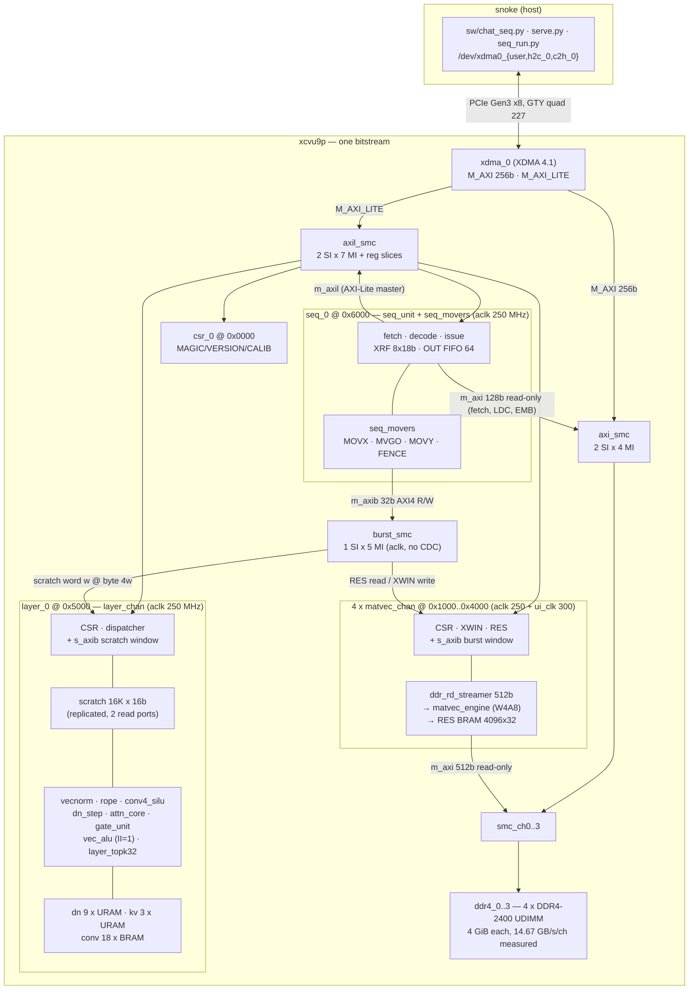

# ARCHITECTURE — fable5_llm as built

**As of 2026-08-12, rung 4** (repo HEAD `ae5a316`). This is the current-state
description: what is on the board, what runs on it, and where the time goes.
The rest of `docs/` is delta-documentation — per-rung frozen specs and gate
reports. This file is the standing picture; when it disagrees with a
`docs/RUNG*_SPEC.md` or an `evidence/*/​*_GATE.md`, **the gate report wins**
(it has the measurement).

| | |
|---|---|
| board | SQRL BCU-1525, `xcvu9p-fsgd2104-2L-e` (3 SLRs), on **snoke** at PCIe `0000:82:00.0` |
| resident bitstream | **`build_041_ckr2_AltSpreadLogic_high`, netlist `c973c18a` (= the VERSION CSR, read back off the silicon at `evidence/qwen9b/g6/003_identity_9b.log`)**, WNS **0.000** / WHS **+0.001**, **0 failing endpoints design-wide, NO waiver** (`evidence/qwen9b/g5/G5D_TIMING.md` §10) — the 9B state-spill design: layer state in DDR, `T <= 4096`, SEQ_ISA v2.1, no pblock, clock root `X2Y2` from `synth/constraints/fable5_clockroot_9b.xdc`. **The margin is zero and the placement was produced once** (§11). HW-validated by `evidence/qwen9b/g6/RD9_GATE.md`. Predecessors: `build_035_fp2a_exc_po`, `54443b9f`, the 2B W8 design (WNS 0.000, no waiver, `evidence/qwen2b/rc/TIMING_035.md` §13.4, HW-validated by `evidence/qwen2b/rd/RD_GATE.md`) — **it no longer runs the 2B: its v1.7 layer ARG words halt this netlist with `err_op`** (`RD9_GATE.md` §8); and `build_034_po2_AltSpreadLogic_high`, `4f908df2`, WNS −0.025 under a written waiver |
| model | **Qwen3.5-9B** instruct, 32 layers (24 DeltaNet + 8 GQA), H=4096, vocab 248,320, **W4 g128 + GPTQ**, residual **int16 Q8.7** (`rs_f = 7`). The pack is 249 images / 3,902 MiB plus a 1,940 MiB embedding table, row-split over all four DDR channels. **This bitstream has no 0.8B/2B back-compat ladder** (plan U4, demonstrated at `RD9_GATE.md` §8). One weight pack fits DDR at a time — a model switch is a full re-upload, and nothing ties the resident pack to the resident model (`RD9_GATE.md` §14.3) |
| decode rate | **9B: 7.2928 tok/s** (`--nch 4`, **137.1210 ms/token** gate convention; **7.2917 tok/s / 137.1413 ms** steady-state, one loop iteration timed on chip) — `evidence/qwen9b/g6/RD9_GATE.md` §10. The layer term splits into **two lanes** now: `L_LCYC` **41.588 ms/token** (compute) beside `L_SDMA_CYC` **5.125 ms/token** (state DMA), which overlap — their sum is 34.1 % of the device time. Historic, on `build_035`: 0.8B **30.4 tok/s** / 2B W8 **16.1 tok/s** (`evidence/qwen2b/rd/RD_GATE.md` §1) |
| bandwidth ceiling | **~169 tok/s** (0.417436 GB/token over **70.70 GB/s** measured aggregate, `tok_meter4`; per-channel probe **17.875 GB/s/chan** — `evidence/qwen2b/rb/RB_GATE.md` H9/H10). This is the `matvec_test` run §5/§7 were pending, and it lands inside the 68-77 GB/s bracket those sections predicted. Supersedes the stage-2 figure, ~140.6 tok/s at 58.7 GB/s |
| evidence | `evidence/rung4/RUNG4_GATE.md` |

---

## 1. The system

### 1.1 Block diagram



Provenance: `synth/scripts/create_project.tcl` (header lines 10-28 give the
address map verbatim; the `axi_smc` / `axil_smc` / `burst_smc` / `smc_ch*`
cells are created at lines 194-307).

### 1.2 Clock domains

There are exactly two clocks that matter, and one CDC boundary.

| domain | frequency | who lives there |
|---|---|---|
| `xdma_0_axi_aclk` (**aclk**) | 250 MHz | everything AXI-Lite; `csr_block`; **all of `layer_chan`** and its units; **all of `seq_unit` + `seq_movers`** (s_axil slave, m_axil master, m_axi 128b fetch master, m_axib 32b burst master — *zero* new CDC); the `matvec_chan` CSR/burst front end |
| `c0_ddr4_ui_clk` x4 (**ui_clk**) | 300.12 MHz | per DDR channel: `ddr_rd_streamer` → `matvec_engine` → result BRAM write side |

The only CDC is inside `matvec_chan`: `xpm_fifo_async` for X-vector writes,
toggle+2FF for the doorbell, 2FF for status, `xpm_memory_tdpram` for results.
Quasi-static config buses cross unsynchronized *by design* (host writes cfg,
*then* rings the doorbell) — declared in `synth/constraints/fable5_cdc.xdc`.
Constants live in `sw/hwmap.py:UI_CLK_HZ / ACLK_HZ`; `PERF_CYC` counts ui_clk,
`LCYC` and `S_PERF_CYC` count aclk.

### 1.3 Address maps

**AXI-Lite BAR** (`/dev/xdma0_user`), 4 KiB per slave — the *same* map the host
and the sequencer both drive (`create_project.tcl:13-17`, `sw/hwmap.py`):

```
0x0000 csr_0     MAGIC 0xFAB1E001 / VERSION / SCRATCH / CALIB / UPTIME
0x1000 mvchan_0  0x2000 mvchan_1  0x3000 mvchan_2  0x4000 mvchan_3
0x5000 layer_0   (+ 0x5048..0x5058 the TOPK-32 window)
0x6000 seq_0
```

**DDR (host DMA view + `seq_0/m_axi`)**: `ddr4_c` at `c * 4 GiB`.
Channel-local layout, from the map in `sw/hwmap.py:304-358`:

```
0x0000_0000  144 MiB  free / scratch  (sw/ddr_test.py destroys ALL of this)
0x0900_0000   48 MiB  SEQ_STREAM_BASE — the record list (<prefix>.seq)
0x0C00_0000   64 MiB  SEQ_DATA_BASE   — the LDC constant blob
0x1000_0000 1280 MiB  W_BASE — 187 packed weight images, 4 KiB-aligned
0x6000_0000  485 MiB  EMB_BASE — embedding table, 248,320 x 2048 B rows
0x7E50_0000            free (2.4 GiB tail)
```

> **Dated note 2026-09-09 (G6, Task 15) — THE RESIDENT 9B MAP.** The two
> sizes above are the 0.8B/2B pack's. At 9B the same bases hold **249**
> images totalling **3,902 MiB** row-split across all four channels
> (978.40 / 975.30 / 974.27 / 974.27 MiB, balanced to 0.42 %), and the
> embedding table is **1,940 MiB** of 248,320 x **8192 B** rows — so
> **EMBLOG2 = 13**, written and read back on every run. `wid 248`, the LM
> head, is chunk-INTERLEAVED across the four engines rather than row-split.
> Measured: `evidence/qwen9b/g6/RD9_GATE.md` §5, §9, §10.3.

**THE DDR STATE REGION (SEQ_ISA v2.1 B15.3) — new at 9B.** The layer state no
longer lives in URAM; it lives in DDR and the host uploads it. The manifest's
`state: {dn, kv, cv, end, sha256, final_sha256}` names it and
`sw/hwmap.plan_state` places it after the weights and the embedding. On the
resident 9B artifact it is **162,529,280 B entirely on DDR channel 3** — the
bases are 34-bit and bits [33:32] are the channel:

```
0x3_8000_0000   24 MiB  SB_DN — 24 DeltaNet blocks x 1 MiB   (host memsets to 0)
0x3_8180_0000  128 MiB  SB_KV — the KV cache, T <= 4096      (never host-written:
                                the RTL writes a row before it reads it)
0x3_8980_0000    3 MiB  SB_CV — 24 conv blocks x 128 KiB     (host writes the
                                conv weight taps; the RTL writes state INTO the
                                same blocks — RD9_GATE.md §14.1)
0x3_89B0_0000           end
```

**Three CSRs carry the bases, in 64 KiB units** (`sw/hwmap.py:225-227`), and
`sw/seq_run.seq_check_state_bases` refuses a run whose bases are zero — the
RTL would otherwise answer `E_DMA_BASE` at the first SLD/SST (SEQ_ISA v2.1
B15.4):

| CSR | offset | resident value | meaning |
|---|---|---|---|
| `L_SB_DN` | `0x5064` | `0x38000` | `0x38000 << 16 = 0x3_8000_0000` |
| `L_SB_KV` | `0x5068` | `0x38180` | |
| `L_SB_CV` | `0x506C` | `0x38980` | |

**The upload step**: `sw/seq_run.upload_state(dev, art)` memsets the DN
region, writes one conv image per layer WITH readback, checks eight DN
witnesses read zero, and programs the three CSRs — all on the same H2C path
as the weights, and skipped with them under `--skip-weights`, which programs
the CSRs only. `verify_state_image(art)` checks the image against the
manifest's sha256 **before** a byte is written. **DDR traffic per token**
(`sw/tok_meter.state_bytes_per_token`, LABEL D): **70.06 MiB at T = 512**,
**182.50 MiB at T = 4,096**.

> **`--skip-weights` DOES NOT RESET THE REGION**, and a run on a dirty region
> answers with the wrong token and no error anywhere
> (`evidence/qwen9b/g6/RD9_GATE.md` §14.2, log `019`). Re-establish it with a
> full `seq_run` or `evidence/qwen9b/g6/g6_state.py --write-initial`.

The emitter bakes *absolute* addresses (`0x8000_0000` / `0x9000_0000`) into
LDC records; `sw/seq_run.py` **relocates** the stream by the difference rather
than uploading at the emitter's addresses. MVGO `WBASE`s are **asserted, never
patched** — if the host's pack and the stream disagree, the stream is simply
wrong for those weights.

**`seq_0/m_axib` private burst map** — 64 KiB stride, visible to no other
master (`create_project.tcl:450-477`, `rtl/seq_movers.sv:8-14`):

```
0x1_0000 mvchan_0 ... 0x4_0000 mvchan_3   read 0x0000-0x3FFF  RES row r @ 4r
                                          write 0x4000-0x57FF XWIN word w @ 4w
0x5_0000                                  decode HOLE (was layer_0 pre-R-b)
0x6_0000 layer_0 (128 KiB)                R/W scratch word w @ 4w, w < 32768
```

R-b (2026-08-13) doubled the layer window to 128 KiB and moved it to
0x6_0000: an AXI segment must be RANGE-ALIGNED and 0x5_0000 is not
128 KiB-aligned (`docs/SEQ_ISA.md` B12.3).

The XWIN write window is 1536 words (K <= 6144, `matvec_engine` MAX_NG = 48).
0x5800-0x5FFF is deliberately NOT in the window — the engine's activation
LUTRAM holds exactly 1536 words, so anything above answers SLVERR rather than
aliasing. Both windows still fit inside the 64 KiB stride, so growing XWIN
needed no address-segment change.

> **Dated note 2026-09-02 (G3.3, Task 9).** The paragraph above, and the
> map it annotates, are `build_035`'s — the resident bitstream. In THIS
> TREE's RTL the window is **3072 words / 12 KiB, `0x4000-0x6FFF`**, with
> `MAX_NG = 96` (K ≤ 12288, the 9B `down_proj` row) and a 12-bit XPTR;
> `0x7000-0x7FFF` is what answers SLVERR now. Both `XWIN_WORDS` copies
> (`rtl/matvec_chan.sv`, `rtl/seq_movers.sv`) moved together, and the
> windows still fit the 64 KiB stride. See `evidence/qwen9b/g3/G3_3_MATVEC.md` §6.

---

## 2. The engines

### 2.1 `matvec_chan` x4 — one per DDR channel

`rtl/matvec_chan.sv` wraps `ddr_rd_streamer` (AXI4 read master, **512-bit**,
INCR bursts up to 64 beats / 4 KiB, 4 outstanding, 256-beat FIFO) feeding
`rtl/matvec_engine.sv` (streamed W4A8 / W8A8 MAC) into a 4096 x 32b result
BRAM.

CSRs at `0x1000*(c+1)`: `CTRL/STATUS/WBASE_LO/HI/WBEATS/SHAPE/PERF_CYC_LO/HI/
PERF_BEATS/XWIN/XPTR/RES_PTR/RES_DATA/IDENT`. `IDENT` reads
`0xFAB1C4A0 | CHAN_ID`. `SHAPE` packs `{w8[29], g64[28], nrows, sh, ng}` —
see `sw/hwmap.py:shape_word()`; `[31:30]` are the remaining spare bits. `ng`
is the **ng-unit** count `K//128` in *every* mode; it equals the weight-beat
count only in W4.

> **Dated note 2026-09-02 (G3.3, Task 9).** The `SHAPE` packing above and
> the two mode bits below are `build_035`'s and are kept because that
> bitstream is resident and `sw/hwmap.shape_word(..., isa=1)` still drives
> it. **THIS TREE's RTL has neither mode**: G3.3 deleted `cfg_w8` and
> `cfg_g64` (spec §5.1 S5, §5.2 S6) and repacked the word as
> `{spare[31:29], ng[28:22], nrows[21:6], sh[5:0]}` so `ng` reaches 96.
> Row beats are `ng + ceil(ng/32)`, the one remaining cadence. See
> `evidence/qwen9b/g3/G3_3_MATVEC.md` §5.

The engine carries **two orthogonal mode bits**. `cfg_g64` picks the W4 group
size: `0` is the frozen stage-2 G=128 row format, `1` is the v2 G=64 format
where each 64 B weight beat carries two 64-element groups and `ceil(NG64/32)`
scale beats follow — the *bytes* are identical between the two, only scale
indexing moves. `cfg_w8` picks the weight **width**: `0` is INT4 nibbles,
`1` is INT8 bytes (V5), where a 64 B beat holds 64 weights instead of 128, so
a row streams `2*ng` weight beats while the scale beats stay bit-for-bit a W4
g128 row's. W8 is defined at g128 cadence only, so `w8 + g64` is illegal —
`shape_word()` asserts it and the engine `$error`s on it. Row beats per mode:
`ng + ceil(ng/32)` (W4 g128), `ng + ceil(2*ng/32)` (W4 g64),
`2*ng + ceil(ng/32)` (W8). `ref/w4a8_ref.py`'s header is the wire spec for
all three, and `docs/SEQ_ISA.md` B9 is the SHAPE-word ruling.

**Rung 4 rewrote the drain path.** The old FSM cost `NG+10` cycles per row
against `NG+1` stream beats — a fixed ~9-cycle bubble. It is now a tagged
retire pipeline (M0/M1/M2/M3/R1/R2), and the measured cadence is:

```
NG >= 5 : period == stream length exactly  -> ZERO exposed bubble
NG <= 4 : floored at 6 cycles by the scale-beat guard -> bubble = 5 - NG
```

(`rtl/matvec_engine.sv` "Row cadence"; gated in sim at 0.00 cyc/row on all
production shapes, `evidence/rung4/RUNG4_GATE.md`.)

Rung 3 added `s_axib`, a 32-bit AXI4 slave **on aclk** exposing the RES rows
(read) and the XWIN FIFO (write) as burstable windows, so the movers stopped
paying ~15-17 cycles per 32-bit word. Arbitration is strict fixed priority to
AXI-Lite; the burst side yields. Burst writes never touch `xptr`, burst reads
never touch `res_ptr`.

### 2.2 `layer_chan` — the banked 24-layer engine

> ### PRE-G3.3 ROWS, KEPT AS THE RECORD — dated note 2026-09-02 (Task 9)
>
> Rows here marked `<!--cites:noquote-->` quote **source that G3.3 DELETED**,
> not source that merely moved: the `cfg_w8` / `cfg_g64` ports and everything that selected on them, SHAPE bits 28 and 29, and the W8-envelope adder tree.  They are kept verbatim, because they
> are the record of what the pre-G3.3 tree said and the argument they support
> rests on them (§0: nothing is deleted or struck).  The exemption marker is
> used for exactly the reason §7.6 gives — *"an exemption is for source that
> no longer exists, not for a citation that has merely moved"* — and every
> citation that had merely MOVED was RENUMBERED instead, mechanically, by
> `evidence/qwen9b/o3/o3_cite_drift.py --base a08a90b`.
> **The post-G3.3 landmark for every row so marked is tabulated in
> `evidence/qwen9b/g3/G3_3_MATVEC.md` §11.1.**

`rtl/layer_chan.sv` (~89 KB) is a **16K x 16b scratchpad** + a command
dispatcher + the verified compute units + the layer state memories. Single
clock domain (aclk). *All* arithmetic happens on chip; the host/sequencer is
scheduler and DMA only, and the semantics are `ref/layer_fixed.py`.

Scratch is `smem_a[32768]` / `smem_b[32768]`, 16-bit signed, **replicated** to
get two independent read ports (`sw/hwmap.py:SCRATCH_WORDS = 32768`).  R-b
widened it from 16K words for Qwen3.5-2B's 25600-word map; every scratch
address field in the ISA is 15 bits (`docs/SEQ_ISA.md` B12).

CSR map (`rtl/layer_chan.sv:12-31`, mirrored in `sw/hwmap.py:56-72`):  <!--cites:noquote-->

```
0x00 CMD   0x04 STATUS {cmd_cnt[15:0],…,err_op,busy}   0x08/0x0C/0x10 ARG0..2
0x14 SPTR  0x18 SWIN   0x1C EOUT   0x20 TCNT   0x24 IDENT 0xFAB1E5A0
0x28 AMAXI 0x2C AMAXV  0x30 LAYER {kv_slot[10:8], dn_slot[4:0]}
0x34 LCYC (busy-cycle accumulator; ANY write clears it — read and difference)
0x38 XRFI  0x3C XRFD   0x40 MAXPL  0x44 MAXPH
0x48 TK_IDENT 0xFAB1704B  0x4C TK_STATUS  0x50 TK_PTR  0x54 TK_VAL  0x58 TK_IDX
```

Twelve opcodes: `1 VN, 2 VNW, 3 ROPET, 4 ROPE, 5 CONVW, 6 CONV, 7 GATE,
8 DNST, 9 KVAP, 10 ATTN, 11 ALU, 12 DNZ` — full ARG packings in the RTL header.

**Layer banking.** One engine serves all 24 transformer layers, selected by the
`LAYER` CSR and latched at command dispatch:

> ### PRE-G3.4 BANKING, KEPT AS THE RECORD — dated note 2026-09-02 (Task 10)
>
> The table below is **THIS TREE's RTL**, which G3.4 re-banked for the 9B
> geometry (spec §4.1 W1′ / A1.1, §4.6 walls 8–11).  What `build_034` /
> `build_035` carry — and they still run — is the pre-G3.4 map: **9 URAM
> banks holding two dn slots each via an in-bank MSB (9 × 4096 × 2048b,
> dn_slot 0..17), 3 KV banks holding two kv slots each (2 kvheads,
> kv_slot 0..5) and 18 BRAM conv banks of 6144**, with `LAYER = 0`
> reducing every banked address to the original single-bank map and
> **no RTL guard at all** on `dn_slot >= 18` / `kv_slot >= 6`.
> U4 retired the multi-geometry contract, so the map below is laid out for
> 9B alone and does **not** reduce bit-identically at LNH = 16.
> Structure and URAM count: `evidence/qwen9b/g3/G3_4_LAYER.md` §2.

| state | banks | geometry | used by |
|---|---|---|---|
| DeltaNet state | **24 URAM banks, ONE dn slot each** — the linear `{dn_slot, head, row}` address cut at the 4096-row URAM depth, which at LNH = 32 falls exactly on the slot boundary | 24 x 4096 x 2048b = **24 × 29 = 696 URAM** | `DNST`, `DNZ` (dn_slot 0..23) |
| KV cache | **8 URAM banks, ONE kv slot each** — `{kv_slot, kvhead, k/v, t[8:0]}` cut the same way | 8 x 4096 x (2048b row + 8b exp) — i.e. **4 kvheads** x {K,V} x **T ≤ 512** = **8 × 29 = 232 URAM** | `KVAP`, `ATTN`, `TCNT`/`TCNT2` (kv_slot 0..7) |
| conv weights + state | **24 BRAM banks**, one per dn slot | 24 x **8192** x 64b (w) + 24 x 8192 x 48b (state) | `CONV`, `CONVW` |

**928 URAM288 of 960 (96.7 %)** — 696 DN + 232 KV.  The DN read/write path
carries `DN_PIPE = 2` register stages on the per-group fan-out and on the
read return (read latency 2 → 6), which is the structure Track P placed;
`rtl/dn_step.sv` leads its address by exactly that much.

`dn_slot >= 24` is now **REFUSED IN HARDWARE** — sticky `err_op`, command
not dispatched (spec §5.4 S9) — instead of being an unguarded host error.
`kv_slot` needs no check: `LAYER` carries three bits and all eight are legal.

`T_MAX = 512` is the KV bank depth and is why `chat_seq --max-ctx` must be
< 512: the RTL wraps `kv_waddr = tcnt[8:0]` **silently** past it.

**The compute units** (each a bit-exact mirror of a `ref/layer_fixed.py` call
site, each with its own Verilator TB):

| unit | file | what it is |
|---|---|---|
| `vec_alu` | `rtl/vec_alu.sv` | vector glue math over the scratch ports: ops 0 DYNQ8, 1 SHIFT32, 2 SCALE, 3 EMUL, 4 ADD, 5 SILU16, 6 SILU32, 7 SIGM16, 8 EMUL32, 9 SHIFT32W, 10 AMAX32, 12 DYNQ16 |
| `vecnorm_unit` | `rtl/vecnorm_unit.sv` | RMSNorm modes 0 (1+w) / 1 (plain w) / 2 (L2), plus the EPS-NORM gated variant. FILL → RSQ → **II=1** OUT loop, N = 2^n ≤ 1024 |
| `attn_core` | `rtl/attn_core.sv` | softmax attention over the quantized KV memory for one q-head, HD=256, T ≤ 512 |
| `dn_step` | `rtl/dn_step.sv` | one gated-delta-rule step for one head; 128 parallel lanes, ~10 cyc/row → ~1300 cyc/head |
| `conv4_silu` | `rtl/conv4_silu.sv` | depthwise 4-tap conv + silu, one channel/cycle, latency 10 |
| `gate_unit` | `rtl/gate_unit.sv` | per-head DeltaNet gates (beta / decay) for `NH` heads, serial — **`NH = 32` since G3.4** (it was 16, and the parameter default was load-bearing because `layer_chan` instantiated it with no override; it now passes `.NH(LNH)`) |
| `rope_unit` | `rtl/rope_unit.sv` | partial RoPE, HD=256, ROT=64, host-precomputed Q15 cos/sin tables |
| `fx_rsqrt` / `fx_recip` / `fx_silu` / `fx_pkg` | `rtl/fx_*.sv` | serial 1/sqrt (~26 cyc), serial 1/x, pipelined silu (6 cyc), and the shared round-half-away-from-zero helpers |

**The II=1 claim, precisely.** Rung 2 turned `vec_alu`'s ~10.8 cyc/elem FSM
walk into an initiation-interval-1 pipeline *with the same stage
decomposition*, so the arithmetic is bit-identical. But II=1 is **not
unconditional** (`rtl/vec_alu.sv:88-93`): it is 1 for ops
0,1,2,3,4,5,6,7,10,12,15; **2 for op 8** (3 words/elem over 2 read ports) and
**2 for op 9** (2 words/elem out of 1 write port); and the two-pass ops
(DYNQ8's iterative exponent search, DYNQ16's block-float exponent) still fully
drain the pipe once per vector. It is a **single lane, always** — AMAX32
first-occurrence-wins and the DYNQ reductions are loop-carried compare/select
recurrences that require arrival order == index order, which forbids lanes.

**The TOPK-32 unit.** `layer_topk32` maintains a running sorted top-32 of the
`y32` values the LM head streams past the AMAX comparator — the same numbers
AMAX32 already sees, so **no extra DDR traffic and no second pass over the
vocabulary**. It is fed by one *registered* 51-bit bundle exported from
`vec_alu` (`{we = t_cp[0] && op==10, val[31:0], idx[17:0]}`), II=1, aclk.
Entries are value-DESC with ties keeping the incumbent (= numpy first-wins).
Reset is the AMAX32 `fresh` flag **only** (`ALU aop 10 with p0[0]=1`) — never a
command boundary — so a vocabulary scanned as N chained chunks accumulates into
one top-32. `count` saturates at 32, `complete` means no AMAX32 is in flight,
`overflow` is sticky when a rejected element *tied* entry[31].

> Naming caveat: the specs and `sw/chat_seq.py:1359` call it "a sibling block
> inside `layer_chan`" and cite `rtl/layer_topk32.sv`. **That file does not
> exist.** `module layer_topk32` is declared inside `rtl/layer_chan.sv`
> (line 1834) and instantiated as `u_topk` (line 575) — i.e. a *child*, not a
> sibling. The RTL says why: adding a file would mean editing
> `create_project.tcl`, which was outside that agent's ownership.

Rung 3 also gave `layer_chan` an `s_axib` AXI4 slave mapping the scratchpad
directly (word w at byte 4w, 64 KiB window, 16-bit datum in the low half).
Engine access has unconditional structural priority; a burst arriving
mid-command is drained and answered `SLVERR`, never silently dropped.

### 2.3 `seq_unit` + `seq_movers` — the on-chip sequencer

`rtl/seq_unit.sv` executes the binary SEQ record stream (`docs/SEQ_ISA.md`,
`ref/seq_format.py`) **directly out of DDR**, replaying instruction-for-
instruction the CSR sequence `sw/infer.py` used to issue from the host. The
arithmetic did not change — the same ARG/CMD writes hit the same `layer_chan`,
the same WBASE/BEATS/SHAPE + doorbell hit the same `matvec_chan` — which is
what let the entire verification ladder carry forward.

Blocks and ports (all on aclk, **zero CDC**):

| port | width | role |
|---|---|---|
| `m_axi` | **128-bit AXI4, READ-ONLY**, 34-bit addr | record prefetch (FIFO depth 64, bursts of 16 beats, 4 outstanding) **and** the LDC / EMB bulk reads |
| `m_axil` | AXI-Lite master, 32b | the *issue* port: drives the exact same `0x0000..0x5000` CSR map the host does. Deliberately **not** mapped to its own slave |
| `m_axib` | **32-bit AXI4 READ/WRITE**, ID width 1 | owned by `seq_movers`; the MOVX/MOVY/LDC/EMB **data** streams over `burst_smc` |
| `s_axil` | AXI-Lite slave, 12b addr | the ISA's `0x2nn` sequencer CSR space, at BAR `0x6000` |

SEQ CSRs (`rtl/seq_unit.sv:25-44`, mirrored in `sw/hwmap.py:178-244`):  <!--cites:noquote-->
> **Dated note 2026-09-02 (G3.4 fix round 1, M7).** The END of that
> `sw/hwmap.py` range was the `SCRATCH_WORDS_BUILT` comment promising
> that Task 10 would raise it. It was rewritten in place — not raising
> it was correct, because no bitstream carrying G3.1's 65,536-word
> scratchpad exists — so the range is kept with its base numbers and
> the post-fix block is `sw/hwmap.py:242-260`.

```
0x00 CTRL {START, ABORT} / R {halted,err,busy}
0x04 STATUS {err_code[31:24], of_ovf[23], out_cnt[22:16], halted, err, busy}
0x08/0x0C BASE_LO/HI   0x10 LEN   0x14 PC
0x18 OUT_FIFO (READ-DRAINS)   0x1C OUT_CNT   0x20 TCNT_SEQ   0x24 ENTRY
0x28 IDENT 0xFAB1E5E0
0x2C PERF_CYC  0x30 PERF_REC  0x34 PERF_AXW  0x38 PERF_AXR  0x3C PERF_FST
0x40 + 4i  XRF[i], i = 0..7
```

Twelve opcodes: `CSRWR, CMD, MOVX, MOVY, MVGO, EMB, AMAXL, JMP, FENCE, HALT,
LDC, XOP`, with indirection codes `IND_NONE / IND_ADD / IND_SUB`.

**The XRF master copy lives in `seq_unit`, not `layer_chan`**, because every
indirected record needs it *combinationally at decode* (~1,656 indirected
records per `model_v2` token; a fabric round-trip each would be pure added
latency). ISA writes are a *side effect of a command retiring*, so the
sequencer refreshes its mirror with a single AXI-Lite read after exactly those
commands (DYNQ8 → `EOUT` → XRF[0]; DYNQ16 → `XRFD` → XRF[1]/XRF[2]).
`XRF_WRITE_THROUGH` (default on) mirrors SEQ-side writes back into
`layer_chan`'s window so the two copies cannot disagree.

**The OUT FIFO is depth 64** (`OF_DEPTH = 64`, `of_cnt = of_wp - of_rp`). Rung 4
widened it from 16, derived the count from the pointers (removing a race
class), and exposed a **sticky `of_ovf`**: a push past full is a **dropped
token**, never a stall, and the sticky bit survives START, halt and drain — so
a host that sees it must treat every later token of that session as suspect.

**`seq_movers`** implements MOVX (scratch → engine XWIN), MVGO (configure +
doorbell + poll a matvec engine), MOVY (engine RES → scratch, with dequant) and
the engine side of FENCE. Rung 3 moved the *bulk streams* to `m_axib`; what
stays on AXI-Lite is exactly the control traffic: MOVX's SPTR/XPTR setup and
closing STATUS read, MVGO's WBASE/BEATS/SHAPE + doorbell + the whole poll path,
MOVY's RES_PTR/SPTR setup, and FENCE's poll. `MVGO_GUARD` (64 aclk cycles)
still exists because `matvec_chan`'s `STATUS.done` is sticky-until-next-start
and the doorbell crosses into ui_clk via toggle+2FF — a done-wire was
explicitly deferred.

---

## 3. The model and the numerics

### 3.1 Qwen3.5-0.8B instruct

`ref/qwen3_5_0.8b_config.json` is the config of record; `ref/layer_ref.py`
reads it and is the float anchor.

| | |
|---|---|
| hidden | 1024, 24 layers, `tie_word_embeddings: true`, vocab **248,320** |
| layer pattern | `full_attention_interval: 4` → 18 `linear_attention` + 6 `full_attention` |
| GQA layers | 8 Q heads / 2 KV heads, **head_dim 256**, partial RoPE over **64 of 256** dims, **theta 1e7**, output gate |
| DeltaNet layers | 16 key heads / 16 value heads, key & value head_dim 128 (so LKD = LVD = 2048), depthwise causal conv kernel 4 over CONV_DIM = 6144, RMSNormGated with silu(z) |
| FFN | SwiGLU, intermediate 3584 |
| norms | RMSNorm eps 1e-6. **Two conventions**: `Qwen3_5RMSNorm` (ln1/ln2/q_norm/k_norm/model.norm) is zero-centered → scale = `1 + w`; `Qwen3_5RMSNormGated` (linear_attn.norm) is one-centered → used as-is |

> `CHARTER.md` states "head_dim 128, RoPE theta 1e6". The shipped checkpoint's
> config says head_dim **256** with `partial_rotary_factor 0.25` (64 rotary
> dims) and theta **1e7**, and that is what `ref/layer_ref.py`, the fixed-point
> spec and the RTL (`attn_core HD=256`, `rope_unit HD=256 ROT=64`) implement.
> The charter figure is stale; the config is the truth.

**Provenance.** The checkpoint is `Qwen/Qwen3.5-0.8B` (**instruct**), snapshot
`2fc06364`, weights blob sha256 `04b1c301…4696` — proven cryptographically and
behaviourally in `evidence/instruct/INSTRUCT_GATE.md`. The Base model was never
downloaded, and the 16/24 fidelity baseline was always the instruct's. The
long-standing "degenerate chat" behaviour was **solely a missing chat
template**, not a quantization failure. The safetensors *header* sha cannot
distinguish Base from Instruct — always record the **blob** sha.

The vision tower (`model.visual.*`) and the multi-token-prediction head
(`mtp.*`) are deliberately ignored: they are not part of the accelerator's
dataflow (`ref/load_qwen35.py` header).

### 3.2 W4A8 and the group size

Weights INT4 with per-group uint16 scale mantissas; activations INT8 with a
per-token power-of-two exponent. `K` must be a multiple of 128.

- **g=128 (default)** — one 64 B weight beat *is* one group; one scale beat per
  row for `K ≤ 4096`. Every artifact committed before v2 is g=128 and stays
  bit-identical.
- **g=64 (opt-in, `SHAPE` bit 28)** — same weight bytes, two groups per beat,
  `ceil((K/64)/32)` scale beats. Measured ~+2/24 top-1 against bf16 at the cost
  of an extra beat once `K > 2048`. Gated on silicon (`evidence/stage5/
  STAGE5_G64_GATE.md`); default stays g=128.

`ref/w4a8_ref.py` is the wire-format and numerics law; `sw/hwmap.py:shape_word`
is the one place the CSR word is packed.

### 3.3 The fixed-point discipline

**`ref/layer_fixed.py` is the law.** Every operation in it is an exact integer
algorithm; the RTL must reproduce it bit-for-bit, and each RTL unit's header
names the `layer_fixed` call site it mirrors. Frozen formats:

```
RS_F  = 8   residual stream int16 Q7.8        QKV_F = 8   conv out / v
NRM_F = 14  L2-normed q,k int16 Q1.14         S_F   = 13  DeltaNet state Q2.13
GAT_F = 15  gates (sigmoid/decay/beta)        CW_F  = 13  conv weights Q2.13
ROPE_F= 15  cos/sin tables                    KVC_F = 6   KV cache mantissa base
```

Three known saturations on the real weights, all documented and deliberate
(`ref/gen_model_script.py` header):

1. `model.norm` — 976/1024 of the final-RMSNorm weights exceed int16 Q1.14.
   **Resolved exactly, no clamping**: store the already-folded `(1+w)` at Q3.12
   and run vecnorm **mode 1** (plain multiplier). Harmless because the only
   consumer is a DYNQ8 feeding the LM head, and argmax is invariant to a
   positive scale.
2. `dt_bias` (2/288 heads) and 3. `A = exp(A_log)` (1/288 heads) exceed the
   `gate_unit` rails. **Resolved by saturation**, because rehoming them would
   require regenerating the softplus/exp2 ROMs. Clamping saturates where the
   ports as built would *wrap* (a fast-forgetting head turning into a
   never-forgetting one). The generator re-measures the error at runtime values
   and reports it; `--allow-clip` is a deliberate, required flag.

**The project method is sim/HW bit-exactness.** Every stage has (a) a
from-scratch reference model, (b) simulation against it before hardware,
(c) hardware evidence with ≥4 seeds each run twice without reprogramming, and
(d) fresh WNS/Fmax. When hardware disagrees with simulation, the bug is real.
The differential-TB pattern (`tb/tb_vecalu_diff.sv`, `tb/tb_vecnorm_diff.sv`:
one randomized stimulus stream into the frozen `tb/legacy/` copy *and* the
current `rtl/` module, each with its own scratch model, nothing assuming equal
cycle counts, plus sabotage self-tests) is the template for RTL rungs.

---

## 4. The artifact chain

```
HF checkpoint (bf16 safetensors, blob 04b1c301…)
   │  ref/load_qwen35.py     numpy-only safetensors reader → weight dicts
   ▼
ref/layer_fixed.py quantizers  (quant_layer / quant_linear / quant_deltanet)
   │
   ▼
ref/gen_model_script.py <out.txt> <prompt_seed> [ntok] --res-scale=8 --allow-clip
   │   emits, for one prompt seed:
   │     <p>.txt            the layer_chan command script (~88 MB)
   │     <p>_w<N>.bin       187 packed W4 weight images (~398 MiB)
   │     <p>.weights.json   the MANIFEST: per-wid {file,nrows,k,ng,stride,nbeats,g}
   │     <p>.emb.bin        the int16 Q7.8 embedding table (485 MiB)
   │
   │  with SEQ_EMIT=<prefix> SEQ_PROFILE=epsnorm [SEQ_NCH=4] the opt-in
   │  ref/seq_format.SeqEmitter ALSO writes (byte-identically to the .txt path):
   ▼
   <prefix>.seq        raw 16 B records, DMA-ready   (e: 60,495 · e4: 68,119)
   <prefix>.seqdata.bin  the LDC constant blob (~1 MB)
   <prefix>.seq.json     metadata: nrec, sha256s, weight plan, expect_tokens
   <prefix>.chip         (tb/scripts/gen_seq_chip_vectors.py) the full post-halt
                         architectural golden for tb_seq_chip
   │
   ▼
ref/seq_chat.TurnCompiler — slices the gated .e.seq into three DDR-resident
   images (preamble / lite prefill / full decode) + a 48 B per-step patch
   │
   ▼
sw/seq_run.py or sw/chat_seq.py — plan_weights → relocate → upload+readback →
   BASE/LEN/ENTRY → START → drain OUT FIFO
   │
   ▼
board
```

**Weight placement** is `sw/hwmap.py:plan_weights()` (R-c: the one authority —
the emitter, the host and the golden all resolve to it) — images laid back to
back from `W_BASE` in wid order, each start aligned up to 4096, and the pack is
*asserted* to end below `EMB_BASE`. It is group-size agnostic (stride and
nbeats come from the manifest) and re-derives `stride == (K/128 + ceil((K/g)/32)) * 64`
so a hand-edited manifest cannot silently misplace an image; at W8 the weight
side of that law doubles (`K/64`) and the scale side does not.

By default the pack is **nch-independent**: every channel reserves the whole
image and a piece is addressed by its GLOBAL row, which is what every artifact
frozen before R-c encodes at nch=1 and nch=4 alike. `SEQ_REPACK=1` (with
`SEQ_NCH>1`) switches to the **per-channel repack**: each channel packs only
the rows it owns, `weights[wid]["base"]` becomes one address per channel, and
the ILV-placed LM head is rebased per chunk. That is the V5 fit prerequisite —
2B W8 is 1,847 MiB as one span (144% of the window) and 465 MiB on the busiest
channel repacked. See `docs/SEQ_ISA.md` B14.

**The LM head** is emitted as 122 chunks of ≤2048 rows
(`for c in range(0, vocab, 2048)` in `ref/gen_model_script.py:492`), chained
into one accumulating AMAX32 scan. In the `--nch 4` stream those 122 chunks are
**interleaved** chunk *j* → engine *j* mod 4 (rung 4 S4, emitter-only — there
is no argmax-combine RTL); every other image is row-split across the four
channels. `evidence/stage5/seq_run4_build033.json` records `ilv_wids = [186]`
and 866 weight writes (vs 187 for 1-chan).

### What is committed vs regenerated

| committed (924 tracked files) | regenerated (`.gitignore`) |
|---|---|
| all `rtl/`, `tb/*.sv`, `ref/*.py`, `sw/*`, `synth/scripts/` + `synth/constraints/` | `tb/scripts/model_*`, `tb/scripts/w3/`, `tb/scripts/w4/` (~950 MB per prompt seed) |
| `tb/vectors/` — the FROZEN per-seed unit-vector tree | `tb/vecv2/`, `tb/vecseq/`, `tb/vectopk/`, `tb/vec_s*` |
| `tb/scripts/layer_s*` and `token_s*` (+ weight bins + manifests) — the frozen stage-3/4 back-compat set. `make layer_scripts` / `token_scripts` **refuse** | `tb/scripts/chain_*`, `token24_*`, `seqlayer_*`, `seqvec/` |
| `rtl/roms/*.hex` (from `ref/gen_roms.py`) | `tb/obj_dir_*`, `synth/out_*` |
| all of `evidence/` — logs, JSON reports, sha256 manifests, gate docs | |

Regeneration commands and the darthplagueis-vs-snoke interpreter quirk are in
`docs/USAGE.md` §6.

---

## 5. Anatomy of a decode step (rung 4)

The shipped flow is **launch-per-step**: three SEQ images stay resident in DDR
and the host patches 48 bytes and presses START once per forward pass
(`docs/CHAT_SEQ_SPEC.md` decision 4, implemented in `sw/chat_seq.py`).

```
preamble   records [0, 1524)        session-once: const LDCs, conv weights,
                                    dnz, L_LAYER, the six TCNT=0 resets
lite       48 B head + [1526,15532) + HALT   14,006 recs — a prefill step
                                             (EMB … just before the LM head;
                                              emits no token)
full       48 B head + [1526,16266) + HALT   14,740 recs — a decode step
                                             (EMB … AMAXL; pushes one token)
```

The 48-byte patch is three CSRWR records: `XRF[3] ← token id`,
`XRF[4] ← pos*1536` (or six LDC address patches under `--pos-mode ldc`), and
`TCNT_SEQ ← 1`. Everything else — 187 weight images, the embedding table, the
LDC blob, the 512-position RoPE blob and the images themselves — stays resident
across turns **and across processes**.

Inside one full launch, per layer: `EMB` → `VN` → the projection matvecs
(MOVX broadcast x, MVGO, FENCE, MOVY drain+dequant) → `CONV`/`GATE`/`DNST` for
a DeltaNet layer or `ROPE`/`KVAP`/`ATTN` for a GQA layer → SwiGLU via `ALU` →
residual add. Then the final RMSNorm and 122 chained LM-head chunks with
AMAX32 accumulating across all of them, and `AMAXL` pushing the winning token
id into the OUT FIFO.

### Where the 31.50 ms goes (`--nch 4`) — CORRECTED 2026-08-12

| bucket | ms/token | share | notes |
|---|---|---|---|
| **layer compute** | **14.13** | **45%** | the #1. `dn_step` / `attn_core` element paths (measured `L_LCYC`). **build_034 measures 15.368 via `tok_meter4` — see `evidence/qwen2b/rb/RB_GATE.md` follow-on 3. build_035's R-d census reads the same `L_LCYC` accumulator on the SEQUENCER path (no serialized replay, no host scratch traffic) and gets 15.128 ms/token at 0.8B and 17.960 at 2B W8 — `evidence/qwen2b/rd/RD_GATE.md` §3** |
| **movers + polls** | **~11.4** | **~36%** | the #2. MOVX/MOVY bursts, LDC, CSR issue, MVGO cfg/polls |
| matvec (DDR) | ~6.0 | ~19% | zero-bubble; **max-channel** beats x the DDR rate |
| **total** | **31.50** | | `(197.64 - 8.671) / 6`, tokens bit-exact |

`--nch 1` is **45.02 ms/token** on the same basis.

> **What changed and why.** This table previously read 32.94 total =
> 14.1 layer + ~10 matvec + ~9 movers. Two errors: (a) `197.64 / 6 = 32.94`
> charges every token 1/6 of the **session-once** 8.671 ms preamble — the
> per-token figure is 31.50, which `chat_seq --canned` measures directly
> (31.476-31.512, `evidence/rung4/chat_canned_4chan.json`); (b) the ~10 ms
> matvec was *assumed*, and ~10 ms/chan at nch=4 implies ~40 ms at nch=1,
> more than the whole 45.02 ms step minus its 14.13 ms layer bucket. The
> mover bucket is bracketed at **[11.17, 11.89] ms** with no calibration at
> all (a per-token burst-beat + CSR floor plus `r >= 1 beat/cycle`), which
> also pins the matvec engine to **17.0-19.2 GB/s/chan** — not the 10.4
> the old note carried. Full derivation, the per-ROW mover cost law and the
> 2B projection: **`evidence/qwen2b/ra/MOVER_NORM.md`**.
> `evidence/rung4/RUNG4_GATE.md` is left as a dated record and still shows
> the old split.

Sampling adds `~68 MMIO accesses ≈ 0.11 ms/token` (IDENT, STATUS, one PTR
write, 2 reads per entry with `TK_IDX` auto-incrementing, one `L_EOUT` read) —
free next to the step (`sw/chat_seq.py:1380-1386`).

> The matvec bandwidth question above is now RESOLVED (2026-08-12,
> `evidence/qwen2b/ra/MOVER_NORM.md` §3). `RUNG4_GATE.md:57`'s "~4.2 GB/s/chan
> measured" has no backing artifact and its "~10.4 GB/s/chan" was derived from
> the assumed ~10 ms matvec, not measured — **no silicon measurement of the
> matvec bucket exists**: `sw/cycle_census.py` reports `mv_ms ≈ 0` because the
> matvec PERF CSRs reset on every engine start, so step-deltas cancel
> (`evidence/rung3/CENSUS.md:70`). The bound that does hold is
> **17.0-19.2 GB/s/chan** (1.0-1.131 ui-clk per 64 B beat), from the nch=1
> step time minus a calibration-free mover floor. Cheapest way to close it for
> real: re-run `sw/matvec_test.py` on build_033 and read its sustained GB/s.
> **CLOSED 2026-08-16 — that run happened, on build_034: 17.875 GB/s/chan
> (four channels within 0.0364 %) and 70.70 GB/s aggregate, inside the bracket.
> `evidence/qwen2b/rb/RB_GATE.md` H9/H10.**

---

## 6. Tool inventory

### `sw/` — host tools (run on snoke, board already programmed)

> **The board lock moved (user ruling O3, 2026-08-29).** It is
> `/home/cah/r2d2/code/fpga/.fable5_board.lock` — ONE file above every
> checkout, on the NFS export both hosts mount, owned by
> `sw/board_lock.py`. `sw/.seq.lock` was per-checkout and therefore
> excluded nothing between the two working trees that share this board
> (`evidence/qwen9b/o3/BOARD_LOCK.md`). Every tool below that programs
> or DMAs the board takes it, and `docs/USAGE.md` §5 is the operator
> version of this column.

| tool | one line | takes the board lock? |
|---|---|---|
| `chat_seq.py` | the fast chat path: three resident SEQ images, one sequencer launch per forward step, 48 B patch per step. Its `SeqLock` is now `board_lock.BoardLock` under the old name. | **yes** |
| `serve.py` | stdlib-only localhost HTTP/SSE front end; imports `chat_seq` as a library, one worker thread owns the board, strictly FIFO | **yes** (not in `--mock`) |
| `cycle_census.py` | per-launch counter deltas (`S_PERF_*`, `L_LCYC`, matvec PERF) decomposing a decode step into layer / matvec / REST | **yes** |
| `chat_client.py` | stdlib readline REPL / one-shot client for `serve.py`; runs anywhere over an SSH tunnel | no (no device) |
| `seq_run.py` | the sequencer runner: load+sha-check → plan → relocate → upload+readback → run → verify tokens. Also provides the `Dev` **identity gate** every tool uses | **yes** (incl. `--dry-run`, which DMAs ~900 MiB; `--selftest` does not) |
| `infer.py` | the original host-driven REPL: drives layer/matvec CSRs command-by-command (~100k MMIO/token, ~9.3 s/token) with every readback checked against the reference. Deep debug + `make infer_gate` | **yes** (`--tok-test` does not) |
| `tok_meter.py` | device-counter tok/s: charges every token with matvec `PERF_CYC/BEATS` and `LCYC` deltas; `--four-chan` row-splits the images | **yes** |
| `mover_bench.py` | per-record-class cycle costing from micro-streams built by replicating real records. **Clobbers the chat-resident stream images** — which is why it took the lock first at O3 | **yes** |
| `layer_test.py` | stage-3 gate: replays command scripts against `layer_chan` with real matvecs. Exports `plan_weights()`, the canonical DDR packer | **yes** |
| `matvec_test.py` | stage-2 gate: per (seed, channel) quantize → DMA → configure → doorbell → compare y32, reporting sustained DDR bandwidth | **yes** |
| `ddr_test.py` | stage-1 DDR4 integrity: PRNG streams over all 4 channels x 4 GiB, bit-exact. **Destroys every DDR region** | **yes** |
| `head_cache.py` | host f32 copy of the LM head — **verification only** (`--verify-head`, board-free sampler gates), explicitly not a decode path | no |
| `board_lock.py` | **THE board lock**: one NFS-visible file for every checkout and both hosts, holder identity (host/pid/user/tool/time/tree), `--status` / `--probe` / `--exec` / `--selftest`, and the `--no-lock` escape every tool inherits | it **is** the lock |
| `hwmap.py` | not a tool: the single source of truth for clocks, CSR offsets, the DDR map and `seq_err_name()` | n/a |
| `pcie_helper.sh` | root PCIe ops: `load` / `remove` / `rescan` / `status` / `debug` / `sbr` / `cfgkick` / `peek`. NOPASSWD sudo | n/a |
| `program_fpga.sh` | the safe reprogram SEQUENCE — `pcie_helper remove` → JTAG (volatile, via `synth/scripts/program.tcl`) → `rescan` — under ONE hold of the board lock, because the device is off the bus for all three steps | **yes**, across the whole sequence |
| `stage1_hw_bringup.sh` | unattended remove → program → rescan → CSR/DDR gates, logged to `evidence/stage1/` | **yes**, one hold for the whole bring-up; the tools it calls inherit it |
| `test_ctl.sh` | bring-up-era control-bitstream smoke test: `pcie_helper remove` -> JTAG (`program_fpga.sh --jtag-only`) -> `rescan` -> BUSDEV readback + a 4 KiB H2C/C2H DMA. Accepts `--no-lock` | **yes**, ONE hold across the whole remove/program/rescan/DMA sequence; `program_fpga.sh` inherits it |
| `Makefile` | target index (`seq_run`, `tok_meter`, `chat4`, `infer_gate`, …). No `serve`/`chat_client` targets — those are an unapplied integrator TODO | n/a |

### `ref/` — reference models and generators

| file | one line |
|---|---|
| `layer_ref.py` | numpy f32 anchor for one decoder layer; mirrors `vendor/modeling_qwen3_5.py` exactly |
| `layer_fixed.py` | **THE spec**: integer-only decoder layer + production quantizers + the frozen format constants |
| `fixedpoint.py` | exact integer primitives (rsqrt, recip, exp2, sigmoid, softplus, silu, round-half-away rshr) — one source for ref *and* the RTL ROMs |
| `w4a8_ref.py` | bit-accurate W4A8 matvec + quantizer + DDR row packing + the g128/g64 wire format |
| `load_qwen35.py` | numpy-only safetensors reader for the real checkpoint → `layer_fixed` weight dicts |
| `gen_roms.py` | writes `rtl/roms/*.hex` straight from `fixedpoint.py` |
| `gen_matvec_vectors.py` | `<out_dir> <seed> <N> <K>` → `params.txt`, `x8.hex`, `beats.hex`, `y32.hex` |
| `gen_layer_vectors.py` | `<out_dir> <seed>` → golden `.hex` per unit block, plus a `roms/` copy |
| `gen_rsqrt_cases.py` / `gen_silu_cases.py` | `<out> <seed>` → bit-exact case lists for `fx_rsqrt` / `fx_silu` |
| `gen_layer_script.py` | `<out> <seed> [ntok]` → one DeltaNet + one GQA layer, random weights. Defines `Mach`, the scratchpad model `infer.py` subclasses |
| `gen_chain_script.py` | `<out> <seed> <ntok> <nlayers>` → an N-layer stack, banked slots, no embed/head |
| `gen_token_script.py` | `<out> <seed> [ntok] [vocab] [nlayers]` → the end-to-end autoregressive token path over a reduced vocab |
| `gen_model_script.py` | `<out> <seed> [ntok]` + `--res-scale`/`--allow-clip`/`--w4-group` → the real model, full vocab, with the runtime range audit |
| `seq_format.py` | the 128-bit SEQ record wire format (single source of truth) + the opt-in `SeqEmitter` + `SEQ_ISA_NOTE_*` deviation markers |
| `seq_model.py` | pure-python executor of a SEQ stream and the **golden for the RTL sequencer**; `--gate <prefix>` asserts .txt and .seq agree bit-for-bit |
| `seq_chat.py` | `TurnCompiler` — chat images as byte slices of the gated `.e.seq` with five whitelisted immediate holes |
| `fidelity_check.py` | how far fixed point moves the model from its bf16 self (top-1 / golden rank / top-5) with sweepable knobs |
| `audit_ranges.py` | saturation audit of the frozen formats against the real weights (`audit_ranges_report.md`) |
| `validate_vs_torch.py` | one-off cross-check of `layer_ref` against real `transformers` |
| `debug_torch_diff.py` | bisection debug of DeltaNet intermediates vs transformers |
| `vendor/` | frozen Apache-2.0 upstream `modeling_qwen3_5.py` / `modular_qwen3_5.py` — the ground truth `layer_ref` mirrors |

### `tb/` — Verilator testbench families (`make -C tb <target>`)

Each TB gets its own `--Mdir obj_dir_<name>`; `obj_dir_*` are NFS-shared, so
**one machine at a time**. Heavy sims run on snoke.

| family | targets | what it proves |
|---|---|---|
| matvec | `tb_matvec`, `tb_matvec_ng`, `tb_streamer_engine`, `tb_matvec_chan`, `tb_mvshim_b` | engine vs `w4a8_ref` bit-exact (NG 1..4 directed and the 9B NG 32/64/96, mixed-shape on one instance without reset); AXI read master under randomized gaps; the full async 250/300 MHz channel; the rung-3 burst shim on the real `matvec_chan`. **G3.3 retired `tb_matvec_g64`, `tb_matvec_w8`, `tb_matvec_chan_g64` and `tb_matvec_chan_w8` with the engine modes they drove — `evidence/qwen9b/g3/G3_3_MATVEC.md` §2 — and moved `tb_streamer_engine`, the SECOND instantiator of `matvec_engine`, onto the new port list (§14.2)** |
| element units | `tb_fx_rsqrt`, `tb_fx_silu`, `tb_conv4_silu`, `tb_rope`, `tb_gate_unit`, `tb_dn_step`, `tb_attn_core`, `tb_vecnorm`, `tb_vec_alu`, `tb_topk` | each unit against `ref/` goldens, 4 seeds. `tb_topk` runs the REAL `layer_chan` and includes 5 comparator sabotage self-tests that MUST fail |
| layer integration | `tb_layer_chan`, `tb_token`, `tb_chain`, `tb_token24`, `tb_model_v2_s*`, `tb_seq_layer`, `tb_layershim_c` | full command-script replay vs `layer_decode_fx`; the frozen stage-3/4 back-compat set; the 8-layer chain; the 24-layer token; the real model; the rung-3 scratch burst window (incl. SLVERR while a live 1024-element ALU op keeps its results bit-exact) |
| sequencer | `tb_seq`, `tb_seq_lat`, `tb_seq_sideband`, `tb_seq_offifo`, `tb_bfab` | `seq_unit`+`seq_movers` against behavioural CSR stubs through a latency-modelling fabric; 7 error paths, 6 micro-benchmarks; fabric-latency sensitivity (LAT 0/8); the OUT FIFO depth/race gate; the burst fabric conformance TB |
| full chip | `tb_seq_chip`, `tb_seq_chip_fast`, `tb_seq_chat_i1` / `chat_i1_gate` | the sequencer driving the **real** `layer_chan` and `matvec_chan`(s), no stubs, streams and weight images served from real files, checked against `ref/seq_model`'s `.chip` golden. `CHIP_NMV=4` gates the 4-chan path. The I1 gate proves a second START preserves the banks and that `pos_mode=ldc` loads the right RoPE table past pos 85 |
| differential | `tb_vecalu_diff`, `tb_vecnorm_diff` (`tb_ru2_diff`) | one randomized stream into the frozen `tb/legacy/` copy AND the current module, each with its own scratch/stream model, nothing assuming equal cycle counts, plus sabotage self-tests. This is the pattern for future RTL rungs |
| bring-up | `tb_csr` | `csr_block` register values, bad-address decode, and the bounded-response "host can never hang" property |

---

## 7. Performance history

Every row traces to a committed gate document. "device" is on-chip busy time
from hardware counters, not wall-clock sampling.

| rung | date | change | ms/token | tok/s | evidence |
|---|---|---|---|---|---|
| — | 2026-07-26 | tok_meter baseline, host-driven MMIO, 4-chan weights | 81.74 device (112.50 1-chan) | 12.23 device / **0.183 wall** | `evidence/stage5/TOKS.md` |
| **0** | 2026-08-08 | `sw/infer.py` live inference: chip-computed argmax fed back, ~100k MMIO/token | ~9,300 wall (98.8% host) | **0.11** | `docs/SPEEDUP_LADDER.md`, `evidence/stage5/infer_gate.log` |
| **1** | 2026-08-09 | **on-chip sequencer**: the chip fetches and executes all 60,495 records itself; wall collapses to device time | 203.34 | **4.91** | `evidence/rung1/STAGE5_RUNG1_GATE.md` |
| 1b | 2026-08-09 | 4-chan weight split — functional, **15% slower** (1404 vs 1220 ms): matvec was only 36% of device time and the LM head could not parallelize under sequential AMAX32. Retained, default off | 234 | 4.27 | `evidence/rung1/STAGE5_RUNG1B_GATE.md` |
| **2** | 2026-08-09 | **`vec_alu` + `vecnorm` II=1 pipelines** — 10.82 → 1.30 cyc/elem, removing 47.1 ms/token of element work. No ISA/script/numerics change | 156.23 | **6.40** | `evidence/rung2/RUNG2_GATE.md` |
| — | 2026-08-10 | **chat-seq**: launch-per-step, resident images, streaming CLI + SSE API. Zero RTL | 150.2 decode / 100.3 prefill-lite | **6.66** streamed | `evidence/chat/CHAT_SEQ_GATE.md` |
| **3** | 2026-08-11 | **burst mover path** — engine RES/XWIN windows and the layer scratch on a 32-bit AXI4 port. AXIL writes −98.6%. Zero ISA/stream/numerics change, zero new CDC | 64.29 | **15.56** | `evidence/rung3/RUNG3_GATE.md` |
| — | 2026-08-11 | **chat template** (host-side only): id-spliced `<\|im_start\|>` wrapper, template on by default. The FPGA starts answering questions | 63.2 decode / 45.0 prefill-lite | 15.8 | `evidence/instruct/INSTRUCT_GATE.md` |
| **4** | 2026-08-12 | **zero-bubble matvec** (9 → 0.00 cyc/row) + **4-chan interleaved LM head** (emitter-only, no argmax RTL) + **TOPK-32** on-chip sampling + OUT FIFO depth 64 & race fixes | 46.46 (nch=1) / **32.94** (nch=4) | 21.5 / **30.4** | `evidence/rung4/RUNG4_GATE.md` |

**Ladder: 0.11 → 4.91 → 6.40 → 15.56 → 30.4 tok/s = 276x** over the original
host CLI. Physics ceiling remains ~140 tok/s.

Two entries in that table are worth remembering as engineering lessons:

- **Rung 1b was a measured failure**, kept and documented rather than deleted.
  Rung 4 avenged it with an emitter-order fix and no argmax RTL at all.
- **The ladder's original rung 3 was refuted by measurement.** A census
  (`evidence/rung3/CENSUS.md`) showed a 150.2 ms step was ~45% MOVY result
  drain over single-beat AXI-Lite and only ~24% matvec DDR — the row bubble was
  #3 on the list, *hidden under mover traffic it could not help until the
  movers were fixed*. Census before choosing a rung.

### Current bottleneck ranking (nch=4, 31.50 ms/token)

Re-ordered 2026-08-12 with the corrected buckets of §5 — **movers overtook
matvec as #2** (derivation: `evidence/qwen2b/ra/MOVER_NORM.md`).

1. **Layer compute — 14.13 ms, ~45%.** The `dn_step` / `attn_core` element
   paths. Still the #1 lever, and now by a wider margin.
2. **Movers + polls — ~11.4 ms, ~36%.** Was believed to be #3 at ~9 ms.
   Sub-levers, biggest first: the **MOVX x-broadcast** (4.8 ms of it) is
   redundant twice over — the same x is streamed once per channel, and the
   scratch holds one int8 per 32-bit word, so every element costs a full
   32-bit beat; packing X8 four-per-word or broadcasting once into all four
   XWINs is the largest single lever left anywhere. Then overlapping MOVY with
   the next MVGO (the "S12 door"), and removing the 64-cycle `MVGO_GUARD`
   (~0.9 ms at nch=4) once `matvec_chan` publishes a done-wire.
3. **Matvec DDR — ~6.0 ms, ~19%.** Genuinely bandwidth-bound at
   **17.0-19.2 GB/s/chan** (bracketed; **measured at 17.875 on build_034**, near
   the bracket's floor — see §5); the hard floor at 1 beat/ui-clk is ~5.5 ms, so
   there is ~0.5 ms in it, not the ~3 the old "floor ~7 ms" implied. Nothing
   more without more channels or a second board.
4. **Physics — ~169 tok/s.** Was ~140 as published (0.417 GB/token over the
   stage-2 58.7 GB/s aggregate); the bracket above implied 68-77 GB/s and so
   ~163-184 tok/s, and build_034 **settles it at 70.70 GB/s aggregate →
   ~169 tok/s** (`evidence/qwen2b/rb/RB_GATE.md` H9/H10), inside the bracket and
   near its floor. Beyond that needs the untouched charter stretch: 2-board
   tensor parallelism over QSFP28 (~280 tok/s ceiling).

Orthogonal and untouched: **weight-stationary batched prefill** — stream each
weight tile once and apply it to all prompt positions. Today every prompt token
is a full forward pass minus the LM head, so a long prompt costs about the same
per token as a decode step.

### Known follow-ons carried forward

- `am_g` is 18 bits and wraps at 262,144 — only **5.6% vocab headroom** over
  248,320. Policy undecided.
- TOPK `overflow` is the literal reading (a rejected element *tied* entry[31]);
  the host cross-check assumes it. `TK_PTR` wraps at 32.
- ~~The flock is not retrofitted into `infer.py` / `seq_run.py` / `tok_meter.py`~~
  **CLOSED 2026-09-01 by the O3 ruling.** One shared NFS-visible lock, taken
  by every board-touching tool and across the whole reprogram sequence;
  `sw/board_lock.py`, `evidence/qwen9b/o3/BOARD_LOCK.md`, `docs/USAGE.md` §5.
  The residual is stated there and is not a code item: a **checkout that has
  not picked up this commit** still locks its own `sw/.seq.lock`.
- `seq_chat` geometry constants vs `derive_geometry` want a cleanup.
- The g64 evidence contradiction between `evidence/stage5/STAGE5_G64_GATE.md`
  prose and the `gen_model_script.py` comment is **unresolved and flagged**.

---

## 8. Where to dig

| you want | read |
|---|---|
| the device map, one authoritative copy | `sw/hwmap.py` |
| the CSR/command set of an engine | the header of `rtl/<module>.sv` — every map in this document is quoted from there |
| the SEQ record encoding | `docs/SEQ_ISA.md` + `ref/seq_format.py` (which catalogs every place the frozen ISA text is not executable as written, as grep-able `SEQ_ISA_NOTE_*` constants) |
| the numerics of any operation | `ref/layer_fixed.py`, and the `layer_fixed` call site each RTL header names |
| the interconnect / BD topology | `synth/scripts/create_project.tcl` (header lines 10-28, cells at 194-307) |
| what a rung was contracted to deliver | `docs/RUNG<N>_SPEC.md` (frozen before the work started) |
| what it actually delivered, measured | `evidence/rung<N>/RUNG<N>_GATE.md` |
| how to drive any of it | `docs/USAGE.md` |
| current state + next action | `NEXT_SESSION.md` |
| the contract the whole project answers to | `CHARTER.md` |
